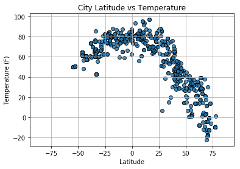
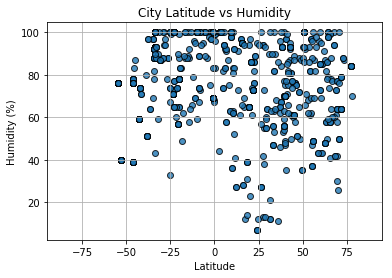
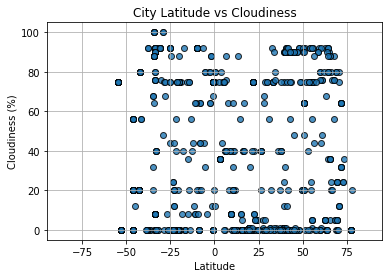
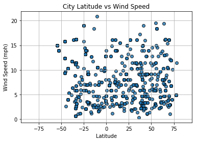

# WeatherPy

Observations:

The latitiude vs temperature plot shows the hottest temps or close to are at the equator (0 degrees) and decrease the further you move from it.

According to the plot many of the cities have at least 60% humidity in the air at the time of the data retrieval.

The wind speed is below 10 mph for most cities in the analysis.


```python
# Dependencies
import random
import numpy as np
import pandas as pd
import matplotlib.pyplot as plt
import openweathermapy as owm
import requests

from citipy import citipy
from config import api_key
```


```python
#randomly select coordinates for cities and store
coord = []
for x in range(0,800):
    lat = np.random.uniform(-90,90)
    lng = np.random.uniform(-180,180)
    x = [lat, lng]
    coord.append(x)
```

# Generate Cities List


```python
#Use citipy to get city and country name for the randomly selected coordinates
cities = []
country = []
for coord_pair in coord:
    lat, lng = coord_pair
    cities.append(citipy.nearest_city(lat, lng).city_name)
    country.append(citipy.nearest_city(lat, lng).country_code)
city_df = pd.DataFrame({'City':cities,'Country':country})


# Add columns for other values

city_df["Latitude"] = ""
city_df["Temperature"] = ""
city_df["Humidity"] = ""
city_df["Cloudiness"] = ""
city_df["Wind Speed"] = ""
city_df.head()
```


<div>
<style scoped>
    .dataframe tbody tr th:only-of-type {
        vertical-align: middle;
    }

    .dataframe tbody tr th {
        vertical-align: top;
    }

    .dataframe thead th {
        text-align: right;
    }
</style>
<table border="1" class="dataframe">
  <thead>
    <tr style="text-align: right;">
      <th></th>
      <th>City</th>
      <th>Country</th>
      <th>Latitude</th>
      <th>Temperature</th>
      <th>Humidity</th>
      <th>Cloudiness</th>
      <th>Wind Speed</th>
    </tr>
  </thead>
  <tbody>
    <tr>
      <th>0</th>
      <td>camacari</td>
      <td>br</td>
      <td></td>
      <td></td>
      <td></td>
      <td></td>
      <td></td>
    </tr>
    <tr>
      <th>1</th>
      <td>oranjemund</td>
      <td>na</td>
      <td></td>
      <td></td>
      <td></td>
      <td></td>
      <td></td>
    </tr>
    <tr>
      <th>2</th>
      <td>talcahuano</td>
      <td>cl</td>
      <td></td>
      <td></td>
      <td></td>
      <td></td>
      <td></td>
    </tr>
    <tr>
      <th>3</th>
      <td>yefira</td>
      <td>gr</td>
      <td></td>
      <td></td>
      <td></td>
      <td></td>
      <td></td>
    </tr>
    <tr>
      <th>4</th>
      <td>nikolskoye</td>
      <td>ru</td>
      <td></td>
      <td></td>
      <td></td>
      <td></td>
      <td></td>
    </tr>
  </tbody>
</table>
</div>


# Perform API Calls


```python
#Counter for rows
row_count = 1

#Loop through cities to gather values for dataframe
for index, row in city_df.iterrows():
    # get city from df
    city = row["City"]
    
    url = "http://api.openweathermap.org/data/2.5/weather?"
    units = "imperial"
    
    # Build partial query URL
    query_url = f"{url}appid={api_key}&units={units}&q="
    
    # Print log to ensure loop is working correctly
    print("Now retrieving city # " + str(row_count) + " " + str(city))
    row_count += 1
   
    # make request and print url
    response = requests.get(query_url + city)
    print(response.url)
    
    response = response.json()
   
    # Append retrieved values to the appropriate columns
    # Use try / except to skip any cities with errors
    try:
        lat_city = response["coord"]["lat"]
        temp_city = response["main"]["temp"]
        hum_city = response["main"]["humidity"]
        cloud_city = response["clouds"]["all"]
        wind_city = response["wind"]["speed"]
        
        city_df.set_value(index, "Latitude", lat_city)
        city_df.set_value(index, "Temperature", temp_city)
        city_df.set_value(index, "Humidity", hum_city)
        city_df.set_value(index, "Cloudiness", cloud_city)
        city_df.set_value(index, "Wind Speed", wind_city)
    
    except (KeyError, IndexError):
        print("Error with city data. Skipping")
        
        continue


```

    Now retrieving city # 1 camacari
    http://api.openweathermap.org/data/2.5/weather?appid=1529784736d3c384bab0fedcbff7b36f&units=imperial&q=camacari
    Now retrieving city # 2 oranjemund
    

    C:\Users\Tamu\Anaconda3\envs\PythonData\lib\site-packages\ipykernel_launcher.py:34: FutureWarning: set_value is deprecated and will be removed in a future release. Please use .at[] or .iat[] accessors instead
    C:\Users\Tamu\Anaconda3\envs\PythonData\lib\site-packages\ipykernel_launcher.py:35: FutureWarning: set_value is deprecated and will be removed in a future release. Please use .at[] or .iat[] accessors instead
    C:\Users\Tamu\Anaconda3\envs\PythonData\lib\site-packages\ipykernel_launcher.py:36: FutureWarning: set_value is deprecated and will be removed in a future release. Please use .at[] or .iat[] accessors instead
    C:\Users\Tamu\Anaconda3\envs\PythonData\lib\site-packages\ipykernel_launcher.py:37: FutureWarning: set_value is deprecated and will be removed in a future release. Please use .at[] or .iat[] accessors instead
    C:\Users\Tamu\Anaconda3\envs\PythonData\lib\site-packages\ipykernel_launcher.py:38: FutureWarning: set_value is deprecated and will be removed in a future release. Please use .at[] or .iat[] accessors instead
    

    http://api.openweathermap.org/data/2.5/weather?appid=1529784736d3c384bab0fedcbff7b36f&units=imperial&q=oranjemund
    Now retrieving city # 3 talcahuano
    http://api.openweathermap.org/data/2.5/weather?appid=1529784736d3c384bab0fedcbff7b36f&units=imperial&q=talcahuano
    Now retrieving city # 4 yefira
    http://api.openweathermap.org/data/2.5/weather?appid=1529784736d3c384bab0fedcbff7b36f&units=imperial&q=yefira
    Error with city data. Skipping
    Now retrieving city # 5 nikolskoye
    

    C:\Users\Tamu\Anaconda3\envs\PythonData\lib\site-packages\ipykernel_launcher.py:43: FutureWarning: set_value is deprecated and will be removed in a future release. Please use .at[] or .iat[] accessors instead
    C:\Users\Tamu\Anaconda3\envs\PythonData\lib\site-packages\ipykernel_launcher.py:44: FutureWarning: set_value is deprecated and will be removed in a future release. Please use .at[] or .iat[] accessors instead
    C:\Users\Tamu\Anaconda3\envs\PythonData\lib\site-packages\ipykernel_launcher.py:45: FutureWarning: set_value is deprecated and will be removed in a future release. Please use .at[] or .iat[] accessors instead
    C:\Users\Tamu\Anaconda3\envs\PythonData\lib\site-packages\ipykernel_launcher.py:46: FutureWarning: set_value is deprecated and will be removed in a future release. Please use .at[] or .iat[] accessors instead
    C:\Users\Tamu\Anaconda3\envs\PythonData\lib\site-packages\ipykernel_launcher.py:47: FutureWarning: set_value is deprecated and will be removed in a future release. Please use .at[] or .iat[] accessors instead
    

    http://api.openweathermap.org/data/2.5/weather?appid=1529784736d3c384bab0fedcbff7b36f&units=imperial&q=nikolskoye
    Now retrieving city # 6 ancud
    http://api.openweathermap.org/data/2.5/weather?appid=1529784736d3c384bab0fedcbff7b36f&units=imperial&q=ancud
    Now retrieving city # 7 albany
    http://api.openweathermap.org/data/2.5/weather?appid=1529784736d3c384bab0fedcbff7b36f&units=imperial&q=albany
    Now retrieving city # 8 mount gambier
    http://api.openweathermap.org/data/2.5/weather?appid=1529784736d3c384bab0fedcbff7b36f&units=imperial&q=mount%20gambier
    Now retrieving city # 9 avera
    http://api.openweathermap.org/data/2.5/weather?appid=1529784736d3c384bab0fedcbff7b36f&units=imperial&q=avera
    Now retrieving city # 10 butaritari
    http://api.openweathermap.org/data/2.5/weather?appid=1529784736d3c384bab0fedcbff7b36f&units=imperial&q=butaritari
    Now retrieving city # 11 hvide sande
    http://api.openweathermap.org/data/2.5/weather?appid=1529784736d3c384bab0fedcbff7b36f&units=imperial&q=hvide%20sande
    Now retrieving city # 12 pili
    http://api.openweathermap.org/data/2.5/weather?appid=1529784736d3c384bab0fedcbff7b36f&units=imperial&q=pili
    Now retrieving city # 13 ler
    http://api.openweathermap.org/data/2.5/weather?appid=1529784736d3c384bab0fedcbff7b36f&units=imperial&q=ler
    Now retrieving city # 14 bengkulu
    http://api.openweathermap.org/data/2.5/weather?appid=1529784736d3c384bab0fedcbff7b36f&units=imperial&q=bengkulu
    Error with city data. Skipping
    Now retrieving city # 15 lata
    http://api.openweathermap.org/data/2.5/weather?appid=1529784736d3c384bab0fedcbff7b36f&units=imperial&q=lata
    Now retrieving city # 16 kapaa
    http://api.openweathermap.org/data/2.5/weather?appid=1529784736d3c384bab0fedcbff7b36f&units=imperial&q=kapaa
    Now retrieving city # 17 albany
    http://api.openweathermap.org/data/2.5/weather?appid=1529784736d3c384bab0fedcbff7b36f&units=imperial&q=albany
    Now retrieving city # 18 keti bandar
    http://api.openweathermap.org/data/2.5/weather?appid=1529784736d3c384bab0fedcbff7b36f&units=imperial&q=keti%20bandar
    Now retrieving city # 19 saint-joseph
    http://api.openweathermap.org/data/2.5/weather?appid=1529784736d3c384bab0fedcbff7b36f&units=imperial&q=saint-joseph
    Now retrieving city # 20 vaini
    http://api.openweathermap.org/data/2.5/weather?appid=1529784736d3c384bab0fedcbff7b36f&units=imperial&q=vaini
    Now retrieving city # 21 saint-augustin
    http://api.openweathermap.org/data/2.5/weather?appid=1529784736d3c384bab0fedcbff7b36f&units=imperial&q=saint-augustin
    Now retrieving city # 22 raahe
    http://api.openweathermap.org/data/2.5/weather?appid=1529784736d3c384bab0fedcbff7b36f&units=imperial&q=raahe
    Now retrieving city # 23 derzhavinsk
    http://api.openweathermap.org/data/2.5/weather?appid=1529784736d3c384bab0fedcbff7b36f&units=imperial&q=derzhavinsk
    Now retrieving city # 24 butaritari
    http://api.openweathermap.org/data/2.5/weather?appid=1529784736d3c384bab0fedcbff7b36f&units=imperial&q=butaritari
    Now retrieving city # 25 hofn
    http://api.openweathermap.org/data/2.5/weather?appid=1529784736d3c384bab0fedcbff7b36f&units=imperial&q=hofn
    Now retrieving city # 26 arraial do cabo
    http://api.openweathermap.org/data/2.5/weather?appid=1529784736d3c384bab0fedcbff7b36f&units=imperial&q=arraial%20do%20cabo
    Now retrieving city # 27 altay
    http://api.openweathermap.org/data/2.5/weather?appid=1529784736d3c384bab0fedcbff7b36f&units=imperial&q=altay
    Now retrieving city # 28 kargil
    http://api.openweathermap.org/data/2.5/weather?appid=1529784736d3c384bab0fedcbff7b36f&units=imperial&q=kargil
    Now retrieving city # 29 santa isabel do rio negro
    http://api.openweathermap.org/data/2.5/weather?appid=1529784736d3c384bab0fedcbff7b36f&units=imperial&q=santa%20isabel%20do%20rio%20negro
    Now retrieving city # 30 atuona
    http://api.openweathermap.org/data/2.5/weather?appid=1529784736d3c384bab0fedcbff7b36f&units=imperial&q=atuona
    Now retrieving city # 31 buraydah
    http://api.openweathermap.org/data/2.5/weather?appid=1529784736d3c384bab0fedcbff7b36f&units=imperial&q=buraydah
    Now retrieving city # 32 kruisfontein
    http://api.openweathermap.org/data/2.5/weather?appid=1529784736d3c384bab0fedcbff7b36f&units=imperial&q=kruisfontein
    Now retrieving city # 33 sur
    http://api.openweathermap.org/data/2.5/weather?appid=1529784736d3c384bab0fedcbff7b36f&units=imperial&q=sur
    Now retrieving city # 34 sistranda
    http://api.openweathermap.org/data/2.5/weather?appid=1529784736d3c384bab0fedcbff7b36f&units=imperial&q=sistranda
    Now retrieving city # 35 ancud
    http://api.openweathermap.org/data/2.5/weather?appid=1529784736d3c384bab0fedcbff7b36f&units=imperial&q=ancud
    Now retrieving city # 36 vardo
    http://api.openweathermap.org/data/2.5/weather?appid=1529784736d3c384bab0fedcbff7b36f&units=imperial&q=vardo
    Now retrieving city # 37 bambous virieux
    http://api.openweathermap.org/data/2.5/weather?appid=1529784736d3c384bab0fedcbff7b36f&units=imperial&q=bambous%20virieux
    Now retrieving city # 38 ndungu
    http://api.openweathermap.org/data/2.5/weather?appid=1529784736d3c384bab0fedcbff7b36f&units=imperial&q=ndungu
    Now retrieving city # 39 kavieng
    http://api.openweathermap.org/data/2.5/weather?appid=1529784736d3c384bab0fedcbff7b36f&units=imperial&q=kavieng
    Now retrieving city # 40 punta arenas
    http://api.openweathermap.org/data/2.5/weather?appid=1529784736d3c384bab0fedcbff7b36f&units=imperial&q=punta%20arenas
    Now retrieving city # 41 hermanus
    http://api.openweathermap.org/data/2.5/weather?appid=1529784736d3c384bab0fedcbff7b36f&units=imperial&q=hermanus
    Now retrieving city # 42 kavieng
    http://api.openweathermap.org/data/2.5/weather?appid=1529784736d3c384bab0fedcbff7b36f&units=imperial&q=kavieng
    Now retrieving city # 43 rikitea
    http://api.openweathermap.org/data/2.5/weather?appid=1529784736d3c384bab0fedcbff7b36f&units=imperial&q=rikitea
    Now retrieving city # 44 hervey bay
    http://api.openweathermap.org/data/2.5/weather?appid=1529784736d3c384bab0fedcbff7b36f&units=imperial&q=hervey%20bay
    Now retrieving city # 45 traverse city
    http://api.openweathermap.org/data/2.5/weather?appid=1529784736d3c384bab0fedcbff7b36f&units=imperial&q=traverse%20city
    Now retrieving city # 46 rikitea
    http://api.openweathermap.org/data/2.5/weather?appid=1529784736d3c384bab0fedcbff7b36f&units=imperial&q=rikitea
    Now retrieving city # 47 mar del plata
    http://api.openweathermap.org/data/2.5/weather?appid=1529784736d3c384bab0fedcbff7b36f&units=imperial&q=mar%20del%20plata
    Now retrieving city # 48 bredasdorp
    http://api.openweathermap.org/data/2.5/weather?appid=1529784736d3c384bab0fedcbff7b36f&units=imperial&q=bredasdorp
    Now retrieving city # 49 burns lake
    http://api.openweathermap.org/data/2.5/weather?appid=1529784736d3c384bab0fedcbff7b36f&units=imperial&q=burns%20lake
    Now retrieving city # 50 barentsburg
    http://api.openweathermap.org/data/2.5/weather?appid=1529784736d3c384bab0fedcbff7b36f&units=imperial&q=barentsburg
    Error with city data. Skipping
    Now retrieving city # 51 punta arenas
    http://api.openweathermap.org/data/2.5/weather?appid=1529784736d3c384bab0fedcbff7b36f&units=imperial&q=punta%20arenas
    Now retrieving city # 52 rikitea
    http://api.openweathermap.org/data/2.5/weather?appid=1529784736d3c384bab0fedcbff7b36f&units=imperial&q=rikitea
    Now retrieving city # 53 new norfolk
    http://api.openweathermap.org/data/2.5/weather?appid=1529784736d3c384bab0fedcbff7b36f&units=imperial&q=new%20norfolk
    Now retrieving city # 54 severo-kurilsk
    http://api.openweathermap.org/data/2.5/weather?appid=1529784736d3c384bab0fedcbff7b36f&units=imperial&q=severo-kurilsk
    Now retrieving city # 55 souillac
    http://api.openweathermap.org/data/2.5/weather?appid=1529784736d3c384bab0fedcbff7b36f&units=imperial&q=souillac
    Now retrieving city # 56 hobart
    http://api.openweathermap.org/data/2.5/weather?appid=1529784736d3c384bab0fedcbff7b36f&units=imperial&q=hobart
    Now retrieving city # 57 puerto ayora
    http://api.openweathermap.org/data/2.5/weather?appid=1529784736d3c384bab0fedcbff7b36f&units=imperial&q=puerto%20ayora
    Now retrieving city # 58 port alfred
    http://api.openweathermap.org/data/2.5/weather?appid=1529784736d3c384bab0fedcbff7b36f&units=imperial&q=port%20alfred
    Now retrieving city # 59 castro
    http://api.openweathermap.org/data/2.5/weather?appid=1529784736d3c384bab0fedcbff7b36f&units=imperial&q=castro
    Now retrieving city # 60 yulara
    http://api.openweathermap.org/data/2.5/weather?appid=1529784736d3c384bab0fedcbff7b36f&units=imperial&q=yulara
    Now retrieving city # 61 vila franca do campo
    http://api.openweathermap.org/data/2.5/weather?appid=1529784736d3c384bab0fedcbff7b36f&units=imperial&q=vila%20franca%20do%20campo
    Now retrieving city # 62 severo-kurilsk
    http://api.openweathermap.org/data/2.5/weather?appid=1529784736d3c384bab0fedcbff7b36f&units=imperial&q=severo-kurilsk
    Now retrieving city # 63 grand gaube
    http://api.openweathermap.org/data/2.5/weather?appid=1529784736d3c384bab0fedcbff7b36f&units=imperial&q=grand%20gaube
    Now retrieving city # 64 alofi
    http://api.openweathermap.org/data/2.5/weather?appid=1529784736d3c384bab0fedcbff7b36f&units=imperial&q=alofi
    Now retrieving city # 65 victoria
    http://api.openweathermap.org/data/2.5/weather?appid=1529784736d3c384bab0fedcbff7b36f&units=imperial&q=victoria
    Now retrieving city # 66 mys shmidta
    http://api.openweathermap.org/data/2.5/weather?appid=1529784736d3c384bab0fedcbff7b36f&units=imperial&q=mys%20shmidta
    Error with city data. Skipping
    Now retrieving city # 67 grindavik
    http://api.openweathermap.org/data/2.5/weather?appid=1529784736d3c384bab0fedcbff7b36f&units=imperial&q=grindavik
    Now retrieving city # 68 petropavlovsk-kamchatskiy
    http://api.openweathermap.org/data/2.5/weather?appid=1529784736d3c384bab0fedcbff7b36f&units=imperial&q=petropavlovsk-kamchatskiy
    Now retrieving city # 69 luderitz
    http://api.openweathermap.org/data/2.5/weather?appid=1529784736d3c384bab0fedcbff7b36f&units=imperial&q=luderitz
    Now retrieving city # 70 cape town
    http://api.openweathermap.org/data/2.5/weather?appid=1529784736d3c384bab0fedcbff7b36f&units=imperial&q=cape%20town
    Now retrieving city # 71 east london
    http://api.openweathermap.org/data/2.5/weather?appid=1529784736d3c384bab0fedcbff7b36f&units=imperial&q=east%20london
    Now retrieving city # 72 wahran
    http://api.openweathermap.org/data/2.5/weather?appid=1529784736d3c384bab0fedcbff7b36f&units=imperial&q=wahran
    Error with city data. Skipping
    Now retrieving city # 73 kapaa
    http://api.openweathermap.org/data/2.5/weather?appid=1529784736d3c384bab0fedcbff7b36f&units=imperial&q=kapaa
    Now retrieving city # 74 salalah
    http://api.openweathermap.org/data/2.5/weather?appid=1529784736d3c384bab0fedcbff7b36f&units=imperial&q=salalah
    Now retrieving city # 75 cape town
    http://api.openweathermap.org/data/2.5/weather?appid=1529784736d3c384bab0fedcbff7b36f&units=imperial&q=cape%20town
    Now retrieving city # 76 cumberland
    http://api.openweathermap.org/data/2.5/weather?appid=1529784736d3c384bab0fedcbff7b36f&units=imperial&q=cumberland
    Now retrieving city # 77 buchanan
    http://api.openweathermap.org/data/2.5/weather?appid=1529784736d3c384bab0fedcbff7b36f&units=imperial&q=buchanan
    Now retrieving city # 78 kaohsiung
    http://api.openweathermap.org/data/2.5/weather?appid=1529784736d3c384bab0fedcbff7b36f&units=imperial&q=kaohsiung
    Now retrieving city # 79 punta arenas
    http://api.openweathermap.org/data/2.5/weather?appid=1529784736d3c384bab0fedcbff7b36f&units=imperial&q=punta%20arenas
    Now retrieving city # 80 rikitea
    http://api.openweathermap.org/data/2.5/weather?appid=1529784736d3c384bab0fedcbff7b36f&units=imperial&q=rikitea
    Now retrieving city # 81 qaanaaq
    http://api.openweathermap.org/data/2.5/weather?appid=1529784736d3c384bab0fedcbff7b36f&units=imperial&q=qaanaaq
    Now retrieving city # 82 aklavik
    http://api.openweathermap.org/data/2.5/weather?appid=1529784736d3c384bab0fedcbff7b36f&units=imperial&q=aklavik
    Now retrieving city # 83 kitakata
    http://api.openweathermap.org/data/2.5/weather?appid=1529784736d3c384bab0fedcbff7b36f&units=imperial&q=kitakata
    Now retrieving city # 84 nikolskoye
    http://api.openweathermap.org/data/2.5/weather?appid=1529784736d3c384bab0fedcbff7b36f&units=imperial&q=nikolskoye
    Now retrieving city # 85 bernau
    http://api.openweathermap.org/data/2.5/weather?appid=1529784736d3c384bab0fedcbff7b36f&units=imperial&q=bernau
    Now retrieving city # 86 punta arenas
    http://api.openweathermap.org/data/2.5/weather?appid=1529784736d3c384bab0fedcbff7b36f&units=imperial&q=punta%20arenas
    Now retrieving city # 87 qasigiannguit
    http://api.openweathermap.org/data/2.5/weather?appid=1529784736d3c384bab0fedcbff7b36f&units=imperial&q=qasigiannguit
    Now retrieving city # 88 cherskiy
    http://api.openweathermap.org/data/2.5/weather?appid=1529784736d3c384bab0fedcbff7b36f&units=imperial&q=cherskiy
    Now retrieving city # 89 punta arenas
    http://api.openweathermap.org/data/2.5/weather?appid=1529784736d3c384bab0fedcbff7b36f&units=imperial&q=punta%20arenas
    Now retrieving city # 90 hermanus
    http://api.openweathermap.org/data/2.5/weather?appid=1529784736d3c384bab0fedcbff7b36f&units=imperial&q=hermanus
    Now retrieving city # 91 new norfolk
    http://api.openweathermap.org/data/2.5/weather?appid=1529784736d3c384bab0fedcbff7b36f&units=imperial&q=new%20norfolk
    Now retrieving city # 92 chillicothe
    http://api.openweathermap.org/data/2.5/weather?appid=1529784736d3c384bab0fedcbff7b36f&units=imperial&q=chillicothe
    Now retrieving city # 93 rikitea
    http://api.openweathermap.org/data/2.5/weather?appid=1529784736d3c384bab0fedcbff7b36f&units=imperial&q=rikitea
    Now retrieving city # 94 port lincoln
    http://api.openweathermap.org/data/2.5/weather?appid=1529784736d3c384bab0fedcbff7b36f&units=imperial&q=port%20lincoln
    Now retrieving city # 95 dandong
    http://api.openweathermap.org/data/2.5/weather?appid=1529784736d3c384bab0fedcbff7b36f&units=imperial&q=dandong
    Now retrieving city # 96 kaitangata
    http://api.openweathermap.org/data/2.5/weather?appid=1529784736d3c384bab0fedcbff7b36f&units=imperial&q=kaitangata
    Now retrieving city # 97 nome
    http://api.openweathermap.org/data/2.5/weather?appid=1529784736d3c384bab0fedcbff7b36f&units=imperial&q=nome
    Now retrieving city # 98 hilo
    http://api.openweathermap.org/data/2.5/weather?appid=1529784736d3c384bab0fedcbff7b36f&units=imperial&q=hilo
    Now retrieving city # 99 qingyuan
    http://api.openweathermap.org/data/2.5/weather?appid=1529784736d3c384bab0fedcbff7b36f&units=imperial&q=qingyuan
    Now retrieving city # 100 ijaki
    http://api.openweathermap.org/data/2.5/weather?appid=1529784736d3c384bab0fedcbff7b36f&units=imperial&q=ijaki
    Error with city data. Skipping
    Now retrieving city # 101 port alfred
    http://api.openweathermap.org/data/2.5/weather?appid=1529784736d3c384bab0fedcbff7b36f&units=imperial&q=port%20alfred
    Now retrieving city # 102 lompoc
    http://api.openweathermap.org/data/2.5/weather?appid=1529784736d3c384bab0fedcbff7b36f&units=imperial&q=lompoc
    Now retrieving city # 103 butaritari
    http://api.openweathermap.org/data/2.5/weather?appid=1529784736d3c384bab0fedcbff7b36f&units=imperial&q=butaritari
    Now retrieving city # 104 katherine
    http://api.openweathermap.org/data/2.5/weather?appid=1529784736d3c384bab0fedcbff7b36f&units=imperial&q=katherine
    Now retrieving city # 105 butaritari
    http://api.openweathermap.org/data/2.5/weather?appid=1529784736d3c384bab0fedcbff7b36f&units=imperial&q=butaritari
    Now retrieving city # 106 salgueiro
    http://api.openweathermap.org/data/2.5/weather?appid=1529784736d3c384bab0fedcbff7b36f&units=imperial&q=salgueiro
    Now retrieving city # 107 yellowknife
    http://api.openweathermap.org/data/2.5/weather?appid=1529784736d3c384bab0fedcbff7b36f&units=imperial&q=yellowknife
    Now retrieving city # 108 barentsburg
    http://api.openweathermap.org/data/2.5/weather?appid=1529784736d3c384bab0fedcbff7b36f&units=imperial&q=barentsburg
    Error with city data. Skipping
    Now retrieving city # 109 bluff
    http://api.openweathermap.org/data/2.5/weather?appid=1529784736d3c384bab0fedcbff7b36f&units=imperial&q=bluff
    Now retrieving city # 110 ponta do sol
    http://api.openweathermap.org/data/2.5/weather?appid=1529784736d3c384bab0fedcbff7b36f&units=imperial&q=ponta%20do%20sol
    Now retrieving city # 111 rosarito
    http://api.openweathermap.org/data/2.5/weather?appid=1529784736d3c384bab0fedcbff7b36f&units=imperial&q=rosarito
    Now retrieving city # 112 omsukchan
    http://api.openweathermap.org/data/2.5/weather?appid=1529784736d3c384bab0fedcbff7b36f&units=imperial&q=omsukchan
    Now retrieving city # 113 huacho
    http://api.openweathermap.org/data/2.5/weather?appid=1529784736d3c384bab0fedcbff7b36f&units=imperial&q=huacho
    Now retrieving city # 114 fortuna
    http://api.openweathermap.org/data/2.5/weather?appid=1529784736d3c384bab0fedcbff7b36f&units=imperial&q=fortuna
    Now retrieving city # 115 kushiro
    http://api.openweathermap.org/data/2.5/weather?appid=1529784736d3c384bab0fedcbff7b36f&units=imperial&q=kushiro
    Now retrieving city # 116 norman wells
    http://api.openweathermap.org/data/2.5/weather?appid=1529784736d3c384bab0fedcbff7b36f&units=imperial&q=norman%20wells
    Now retrieving city # 117 mahebourg
    http://api.openweathermap.org/data/2.5/weather?appid=1529784736d3c384bab0fedcbff7b36f&units=imperial&q=mahebourg
    Now retrieving city # 118 butaritari
    http://api.openweathermap.org/data/2.5/weather?appid=1529784736d3c384bab0fedcbff7b36f&units=imperial&q=butaritari
    Now retrieving city # 119 sao filipe
    http://api.openweathermap.org/data/2.5/weather?appid=1529784736d3c384bab0fedcbff7b36f&units=imperial&q=sao%20filipe
    Now retrieving city # 120 rosario oeste
    http://api.openweathermap.org/data/2.5/weather?appid=1529784736d3c384bab0fedcbff7b36f&units=imperial&q=rosario%20oeste
    Now retrieving city # 121 vaini
    http://api.openweathermap.org/data/2.5/weather?appid=1529784736d3c384bab0fedcbff7b36f&units=imperial&q=vaini
    Now retrieving city # 122 san jorge
    http://api.openweathermap.org/data/2.5/weather?appid=1529784736d3c384bab0fedcbff7b36f&units=imperial&q=san%20jorge
    Now retrieving city # 123 ossora
    http://api.openweathermap.org/data/2.5/weather?appid=1529784736d3c384bab0fedcbff7b36f&units=imperial&q=ossora
    Now retrieving city # 124 morris
    http://api.openweathermap.org/data/2.5/weather?appid=1529784736d3c384bab0fedcbff7b36f&units=imperial&q=morris
    Now retrieving city # 125 hualmay
    http://api.openweathermap.org/data/2.5/weather?appid=1529784736d3c384bab0fedcbff7b36f&units=imperial&q=hualmay
    Now retrieving city # 126 omboue
    http://api.openweathermap.org/data/2.5/weather?appid=1529784736d3c384bab0fedcbff7b36f&units=imperial&q=omboue
    Now retrieving city # 127 ushuaia
    http://api.openweathermap.org/data/2.5/weather?appid=1529784736d3c384bab0fedcbff7b36f&units=imperial&q=ushuaia
    Now retrieving city # 128 ahipara
    http://api.openweathermap.org/data/2.5/weather?appid=1529784736d3c384bab0fedcbff7b36f&units=imperial&q=ahipara
    Now retrieving city # 129 fairbanks
    http://api.openweathermap.org/data/2.5/weather?appid=1529784736d3c384bab0fedcbff7b36f&units=imperial&q=fairbanks
    Now retrieving city # 130 guangyuan
    http://api.openweathermap.org/data/2.5/weather?appid=1529784736d3c384bab0fedcbff7b36f&units=imperial&q=guangyuan
    Now retrieving city # 131 haines junction
    http://api.openweathermap.org/data/2.5/weather?appid=1529784736d3c384bab0fedcbff7b36f&units=imperial&q=haines%20junction
    Now retrieving city # 132 melnikovo
    http://api.openweathermap.org/data/2.5/weather?appid=1529784736d3c384bab0fedcbff7b36f&units=imperial&q=melnikovo
    Now retrieving city # 133 albany
    http://api.openweathermap.org/data/2.5/weather?appid=1529784736d3c384bab0fedcbff7b36f&units=imperial&q=albany
    Now retrieving city # 134 jabonga
    http://api.openweathermap.org/data/2.5/weather?appid=1529784736d3c384bab0fedcbff7b36f&units=imperial&q=jabonga
    Now retrieving city # 135 kamenskoye
    http://api.openweathermap.org/data/2.5/weather?appid=1529784736d3c384bab0fedcbff7b36f&units=imperial&q=kamenskoye
    Error with city data. Skipping
    Now retrieving city # 136 thano bula khan
    http://api.openweathermap.org/data/2.5/weather?appid=1529784736d3c384bab0fedcbff7b36f&units=imperial&q=thano%20bula%20khan
    Error with city data. Skipping
    Now retrieving city # 137 manaure
    http://api.openweathermap.org/data/2.5/weather?appid=1529784736d3c384bab0fedcbff7b36f&units=imperial&q=manaure
    Now retrieving city # 138 sorland
    http://api.openweathermap.org/data/2.5/weather?appid=1529784736d3c384bab0fedcbff7b36f&units=imperial&q=sorland
    Now retrieving city # 139 mackenzie
    http://api.openweathermap.org/data/2.5/weather?appid=1529784736d3c384bab0fedcbff7b36f&units=imperial&q=mackenzie
    Now retrieving city # 140 toguchin
    http://api.openweathermap.org/data/2.5/weather?appid=1529784736d3c384bab0fedcbff7b36f&units=imperial&q=toguchin
    Now retrieving city # 141 mataura
    http://api.openweathermap.org/data/2.5/weather?appid=1529784736d3c384bab0fedcbff7b36f&units=imperial&q=mataura
    Now retrieving city # 142 namibe
    http://api.openweathermap.org/data/2.5/weather?appid=1529784736d3c384bab0fedcbff7b36f&units=imperial&q=namibe
    Now retrieving city # 143 boralday
    http://api.openweathermap.org/data/2.5/weather?appid=1529784736d3c384bab0fedcbff7b36f&units=imperial&q=boralday
    Now retrieving city # 144 awjilah
    http://api.openweathermap.org/data/2.5/weather?appid=1529784736d3c384bab0fedcbff7b36f&units=imperial&q=awjilah
    Now retrieving city # 145 lavrentiya
    http://api.openweathermap.org/data/2.5/weather?appid=1529784736d3c384bab0fedcbff7b36f&units=imperial&q=lavrentiya
    Now retrieving city # 146 tuktoyaktuk
    http://api.openweathermap.org/data/2.5/weather?appid=1529784736d3c384bab0fedcbff7b36f&units=imperial&q=tuktoyaktuk
    Now retrieving city # 147 saint george
    http://api.openweathermap.org/data/2.5/weather?appid=1529784736d3c384bab0fedcbff7b36f&units=imperial&q=saint%20george
    Now retrieving city # 148 carnarvon
    http://api.openweathermap.org/data/2.5/weather?appid=1529784736d3c384bab0fedcbff7b36f&units=imperial&q=carnarvon
    Now retrieving city # 149 rikitea
    http://api.openweathermap.org/data/2.5/weather?appid=1529784736d3c384bab0fedcbff7b36f&units=imperial&q=rikitea
    Now retrieving city # 150 saint george
    http://api.openweathermap.org/data/2.5/weather?appid=1529784736d3c384bab0fedcbff7b36f&units=imperial&q=saint%20george
    Now retrieving city # 151 sur
    http://api.openweathermap.org/data/2.5/weather?appid=1529784736d3c384bab0fedcbff7b36f&units=imperial&q=sur
    Now retrieving city # 152 hilo
    http://api.openweathermap.org/data/2.5/weather?appid=1529784736d3c384bab0fedcbff7b36f&units=imperial&q=hilo
    Now retrieving city # 153 mataura
    http://api.openweathermap.org/data/2.5/weather?appid=1529784736d3c384bab0fedcbff7b36f&units=imperial&q=mataura
    Now retrieving city # 154 tula
    http://api.openweathermap.org/data/2.5/weather?appid=1529784736d3c384bab0fedcbff7b36f&units=imperial&q=tula
    Now retrieving city # 155 cidreira
    http://api.openweathermap.org/data/2.5/weather?appid=1529784736d3c384bab0fedcbff7b36f&units=imperial&q=cidreira
    Now retrieving city # 156 severo-kurilsk
    http://api.openweathermap.org/data/2.5/weather?appid=1529784736d3c384bab0fedcbff7b36f&units=imperial&q=severo-kurilsk
    Now retrieving city # 157 vrangel
    http://api.openweathermap.org/data/2.5/weather?appid=1529784736d3c384bab0fedcbff7b36f&units=imperial&q=vrangel
    Now retrieving city # 158 bluff
    http://api.openweathermap.org/data/2.5/weather?appid=1529784736d3c384bab0fedcbff7b36f&units=imperial&q=bluff
    Now retrieving city # 159 kodiak
    http://api.openweathermap.org/data/2.5/weather?appid=1529784736d3c384bab0fedcbff7b36f&units=imperial&q=kodiak
    Now retrieving city # 160 barentsburg
    http://api.openweathermap.org/data/2.5/weather?appid=1529784736d3c384bab0fedcbff7b36f&units=imperial&q=barentsburg
    Error with city data. Skipping
    Now retrieving city # 161 rikitea
    http://api.openweathermap.org/data/2.5/weather?appid=1529784736d3c384bab0fedcbff7b36f&units=imperial&q=rikitea
    Now retrieving city # 162 rikitea
    http://api.openweathermap.org/data/2.5/weather?appid=1529784736d3c384bab0fedcbff7b36f&units=imperial&q=rikitea
    Now retrieving city # 163 punta arenas
    http://api.openweathermap.org/data/2.5/weather?appid=1529784736d3c384bab0fedcbff7b36f&units=imperial&q=punta%20arenas
    Now retrieving city # 164 katsuura
    http://api.openweathermap.org/data/2.5/weather?appid=1529784736d3c384bab0fedcbff7b36f&units=imperial&q=katsuura
    Now retrieving city # 165 flinders
    http://api.openweathermap.org/data/2.5/weather?appid=1529784736d3c384bab0fedcbff7b36f&units=imperial&q=flinders
    Now retrieving city # 166 port elizabeth
    http://api.openweathermap.org/data/2.5/weather?appid=1529784736d3c384bab0fedcbff7b36f&units=imperial&q=port%20elizabeth
    Now retrieving city # 167 punta de piedra
    http://api.openweathermap.org/data/2.5/weather?appid=1529784736d3c384bab0fedcbff7b36f&units=imperial&q=punta%20de%20piedra
    Now retrieving city # 168 herouville-saint-clair
    http://api.openweathermap.org/data/2.5/weather?appid=1529784736d3c384bab0fedcbff7b36f&units=imperial&q=herouville-saint-clair
    Now retrieving city # 169 mar del plata
    http://api.openweathermap.org/data/2.5/weather?appid=1529784736d3c384bab0fedcbff7b36f&units=imperial&q=mar%20del%20plata
    Now retrieving city # 170 airai
    http://api.openweathermap.org/data/2.5/weather?appid=1529784736d3c384bab0fedcbff7b36f&units=imperial&q=airai
    Now retrieving city # 171 vaini
    http://api.openweathermap.org/data/2.5/weather?appid=1529784736d3c384bab0fedcbff7b36f&units=imperial&q=vaini
    Now retrieving city # 172 avarua
    http://api.openweathermap.org/data/2.5/weather?appid=1529784736d3c384bab0fedcbff7b36f&units=imperial&q=avarua
    Now retrieving city # 173 punta arenas
    http://api.openweathermap.org/data/2.5/weather?appid=1529784736d3c384bab0fedcbff7b36f&units=imperial&q=punta%20arenas
    Now retrieving city # 174 gornopravdinsk
    http://api.openweathermap.org/data/2.5/weather?appid=1529784736d3c384bab0fedcbff7b36f&units=imperial&q=gornopravdinsk
    Now retrieving city # 175 umzimvubu
    http://api.openweathermap.org/data/2.5/weather?appid=1529784736d3c384bab0fedcbff7b36f&units=imperial&q=umzimvubu
    Error with city data. Skipping
    Now retrieving city # 176 esperance
    http://api.openweathermap.org/data/2.5/weather?appid=1529784736d3c384bab0fedcbff7b36f&units=imperial&q=esperance
    Now retrieving city # 177 puerto ayora
    http://api.openweathermap.org/data/2.5/weather?appid=1529784736d3c384bab0fedcbff7b36f&units=imperial&q=puerto%20ayora
    Now retrieving city # 178 ushuaia
    http://api.openweathermap.org/data/2.5/weather?appid=1529784736d3c384bab0fedcbff7b36f&units=imperial&q=ushuaia
    Now retrieving city # 179 byron bay
    http://api.openweathermap.org/data/2.5/weather?appid=1529784736d3c384bab0fedcbff7b36f&units=imperial&q=byron%20bay
    Now retrieving city # 180 champerico
    http://api.openweathermap.org/data/2.5/weather?appid=1529784736d3c384bab0fedcbff7b36f&units=imperial&q=champerico
    Now retrieving city # 181 bengkulu
    http://api.openweathermap.org/data/2.5/weather?appid=1529784736d3c384bab0fedcbff7b36f&units=imperial&q=bengkulu
    Error with city data. Skipping
    Now retrieving city # 182 bilsanda
    http://api.openweathermap.org/data/2.5/weather?appid=1529784736d3c384bab0fedcbff7b36f&units=imperial&q=bilsanda
    Now retrieving city # 183 new norfolk
    http://api.openweathermap.org/data/2.5/weather?appid=1529784736d3c384bab0fedcbff7b36f&units=imperial&q=new%20norfolk
    Now retrieving city # 184 jalu
    http://api.openweathermap.org/data/2.5/weather?appid=1529784736d3c384bab0fedcbff7b36f&units=imperial&q=jalu
    Now retrieving city # 185 amderma
    http://api.openweathermap.org/data/2.5/weather?appid=1529784736d3c384bab0fedcbff7b36f&units=imperial&q=amderma
    Error with city data. Skipping
    Now retrieving city # 186 daru
    http://api.openweathermap.org/data/2.5/weather?appid=1529784736d3c384bab0fedcbff7b36f&units=imperial&q=daru
    Now retrieving city # 187 qaanaaq
    http://api.openweathermap.org/data/2.5/weather?appid=1529784736d3c384bab0fedcbff7b36f&units=imperial&q=qaanaaq
    Now retrieving city # 188 borborema
    http://api.openweathermap.org/data/2.5/weather?appid=1529784736d3c384bab0fedcbff7b36f&units=imperial&q=borborema
    Now retrieving city # 189 mahebourg
    http://api.openweathermap.org/data/2.5/weather?appid=1529784736d3c384bab0fedcbff7b36f&units=imperial&q=mahebourg
    Now retrieving city # 190 kodiak
    http://api.openweathermap.org/data/2.5/weather?appid=1529784736d3c384bab0fedcbff7b36f&units=imperial&q=kodiak
    Now retrieving city # 191 sao filipe
    http://api.openweathermap.org/data/2.5/weather?appid=1529784736d3c384bab0fedcbff7b36f&units=imperial&q=sao%20filipe
    Now retrieving city # 192 port alfred
    http://api.openweathermap.org/data/2.5/weather?appid=1529784736d3c384bab0fedcbff7b36f&units=imperial&q=port%20alfred
    Now retrieving city # 193 taolanaro
    http://api.openweathermap.org/data/2.5/weather?appid=1529784736d3c384bab0fedcbff7b36f&units=imperial&q=taolanaro
    Error with city data. Skipping
    Now retrieving city # 194 taolanaro
    http://api.openweathermap.org/data/2.5/weather?appid=1529784736d3c384bab0fedcbff7b36f&units=imperial&q=taolanaro
    Error with city data. Skipping
    Now retrieving city # 195 punta arenas
    http://api.openweathermap.org/data/2.5/weather?appid=1529784736d3c384bab0fedcbff7b36f&units=imperial&q=punta%20arenas
    Now retrieving city # 196 cairns
    http://api.openweathermap.org/data/2.5/weather?appid=1529784736d3c384bab0fedcbff7b36f&units=imperial&q=cairns
    Now retrieving city # 197 mukhen
    http://api.openweathermap.org/data/2.5/weather?appid=1529784736d3c384bab0fedcbff7b36f&units=imperial&q=mukhen
    Now retrieving city # 198 nizhneyansk
    http://api.openweathermap.org/data/2.5/weather?appid=1529784736d3c384bab0fedcbff7b36f&units=imperial&q=nizhneyansk
    Error with city data. Skipping
    Now retrieving city # 199 mahanoro
    http://api.openweathermap.org/data/2.5/weather?appid=1529784736d3c384bab0fedcbff7b36f&units=imperial&q=mahanoro
    Now retrieving city # 200 severo-kurilsk
    http://api.openweathermap.org/data/2.5/weather?appid=1529784736d3c384bab0fedcbff7b36f&units=imperial&q=severo-kurilsk
    Now retrieving city # 201 alice
    http://api.openweathermap.org/data/2.5/weather?appid=1529784736d3c384bab0fedcbff7b36f&units=imperial&q=alice
    Now retrieving city # 202 kaitangata
    http://api.openweathermap.org/data/2.5/weather?appid=1529784736d3c384bab0fedcbff7b36f&units=imperial&q=kaitangata
    Now retrieving city # 203 avera
    http://api.openweathermap.org/data/2.5/weather?appid=1529784736d3c384bab0fedcbff7b36f&units=imperial&q=avera
    Now retrieving city # 204 sokolo
    http://api.openweathermap.org/data/2.5/weather?appid=1529784736d3c384bab0fedcbff7b36f&units=imperial&q=sokolo
    Now retrieving city # 205 cape town
    http://api.openweathermap.org/data/2.5/weather?appid=1529784736d3c384bab0fedcbff7b36f&units=imperial&q=cape%20town
    Now retrieving city # 206 punta arenas
    http://api.openweathermap.org/data/2.5/weather?appid=1529784736d3c384bab0fedcbff7b36f&units=imperial&q=punta%20arenas
    Now retrieving city # 207 qaanaaq
    http://api.openweathermap.org/data/2.5/weather?appid=1529784736d3c384bab0fedcbff7b36f&units=imperial&q=qaanaaq
    Now retrieving city # 208 barentsburg
    http://api.openweathermap.org/data/2.5/weather?appid=1529784736d3c384bab0fedcbff7b36f&units=imperial&q=barentsburg
    Error with city data. Skipping
    Now retrieving city # 209 ushuaia
    http://api.openweathermap.org/data/2.5/weather?appid=1529784736d3c384bab0fedcbff7b36f&units=imperial&q=ushuaia
    Now retrieving city # 210 tautira
    http://api.openweathermap.org/data/2.5/weather?appid=1529784736d3c384bab0fedcbff7b36f&units=imperial&q=tautira
    Now retrieving city # 211 longyearbyen
    http://api.openweathermap.org/data/2.5/weather?appid=1529784736d3c384bab0fedcbff7b36f&units=imperial&q=longyearbyen
    Now retrieving city # 212 aginskoye
    http://api.openweathermap.org/data/2.5/weather?appid=1529784736d3c384bab0fedcbff7b36f&units=imperial&q=aginskoye
    Now retrieving city # 213 ilhabela
    http://api.openweathermap.org/data/2.5/weather?appid=1529784736d3c384bab0fedcbff7b36f&units=imperial&q=ilhabela
    Now retrieving city # 214 umzimvubu
    http://api.openweathermap.org/data/2.5/weather?appid=1529784736d3c384bab0fedcbff7b36f&units=imperial&q=umzimvubu
    Error with city data. Skipping
    Now retrieving city # 215 douglas
    http://api.openweathermap.org/data/2.5/weather?appid=1529784736d3c384bab0fedcbff7b36f&units=imperial&q=douglas
    Now retrieving city # 216 dikson
    http://api.openweathermap.org/data/2.5/weather?appid=1529784736d3c384bab0fedcbff7b36f&units=imperial&q=dikson
    Now retrieving city # 217 atambua
    http://api.openweathermap.org/data/2.5/weather?appid=1529784736d3c384bab0fedcbff7b36f&units=imperial&q=atambua
    Now retrieving city # 218 auki
    http://api.openweathermap.org/data/2.5/weather?appid=1529784736d3c384bab0fedcbff7b36f&units=imperial&q=auki
    Now retrieving city # 219 barrow
    http://api.openweathermap.org/data/2.5/weather?appid=1529784736d3c384bab0fedcbff7b36f&units=imperial&q=barrow
    Now retrieving city # 220 thompson
    http://api.openweathermap.org/data/2.5/weather?appid=1529784736d3c384bab0fedcbff7b36f&units=imperial&q=thompson
    Now retrieving city # 221 busselton
    http://api.openweathermap.org/data/2.5/weather?appid=1529784736d3c384bab0fedcbff7b36f&units=imperial&q=busselton
    Now retrieving city # 222 wladyslawowo
    http://api.openweathermap.org/data/2.5/weather?appid=1529784736d3c384bab0fedcbff7b36f&units=imperial&q=wladyslawowo
    Now retrieving city # 223 palabuhanratu
    http://api.openweathermap.org/data/2.5/weather?appid=1529784736d3c384bab0fedcbff7b36f&units=imperial&q=palabuhanratu
    Error with city data. Skipping
    Now retrieving city # 224 itarema
    http://api.openweathermap.org/data/2.5/weather?appid=1529784736d3c384bab0fedcbff7b36f&units=imperial&q=itarema
    Now retrieving city # 225 khatanga
    http://api.openweathermap.org/data/2.5/weather?appid=1529784736d3c384bab0fedcbff7b36f&units=imperial&q=khatanga
    Now retrieving city # 226 atuona
    http://api.openweathermap.org/data/2.5/weather?appid=1529784736d3c384bab0fedcbff7b36f&units=imperial&q=atuona
    Now retrieving city # 227 port lincoln
    http://api.openweathermap.org/data/2.5/weather?appid=1529784736d3c384bab0fedcbff7b36f&units=imperial&q=port%20lincoln
    Now retrieving city # 228 hofn
    http://api.openweathermap.org/data/2.5/weather?appid=1529784736d3c384bab0fedcbff7b36f&units=imperial&q=hofn
    Now retrieving city # 229 taolanaro
    http://api.openweathermap.org/data/2.5/weather?appid=1529784736d3c384bab0fedcbff7b36f&units=imperial&q=taolanaro
    Error with city data. Skipping
    Now retrieving city # 230 tiksi
    http://api.openweathermap.org/data/2.5/weather?appid=1529784736d3c384bab0fedcbff7b36f&units=imperial&q=tiksi
    Now retrieving city # 231 saint-philippe
    http://api.openweathermap.org/data/2.5/weather?appid=1529784736d3c384bab0fedcbff7b36f&units=imperial&q=saint-philippe
    Now retrieving city # 232 puerto ayora
    http://api.openweathermap.org/data/2.5/weather?appid=1529784736d3c384bab0fedcbff7b36f&units=imperial&q=puerto%20ayora
    Now retrieving city # 233 haines junction
    http://api.openweathermap.org/data/2.5/weather?appid=1529784736d3c384bab0fedcbff7b36f&units=imperial&q=haines%20junction
    Now retrieving city # 234 high rock
    http://api.openweathermap.org/data/2.5/weather?appid=1529784736d3c384bab0fedcbff7b36f&units=imperial&q=high%20rock
    Now retrieving city # 235 vung tau
    http://api.openweathermap.org/data/2.5/weather?appid=1529784736d3c384bab0fedcbff7b36f&units=imperial&q=vung%20tau
    Now retrieving city # 236 touros
    http://api.openweathermap.org/data/2.5/weather?appid=1529784736d3c384bab0fedcbff7b36f&units=imperial&q=touros
    Now retrieving city # 237 albany
    http://api.openweathermap.org/data/2.5/weather?appid=1529784736d3c384bab0fedcbff7b36f&units=imperial&q=albany
    Now retrieving city # 238 durant
    http://api.openweathermap.org/data/2.5/weather?appid=1529784736d3c384bab0fedcbff7b36f&units=imperial&q=durant
    Now retrieving city # 239 guerrero negro
    http://api.openweathermap.org/data/2.5/weather?appid=1529784736d3c384bab0fedcbff7b36f&units=imperial&q=guerrero%20negro
    Now retrieving city # 240 batagay-alyta
    http://api.openweathermap.org/data/2.5/weather?appid=1529784736d3c384bab0fedcbff7b36f&units=imperial&q=batagay-alyta
    Now retrieving city # 241 kapaa
    http://api.openweathermap.org/data/2.5/weather?appid=1529784736d3c384bab0fedcbff7b36f&units=imperial&q=kapaa
    Now retrieving city # 242 bandarbeyla
    http://api.openweathermap.org/data/2.5/weather?appid=1529784736d3c384bab0fedcbff7b36f&units=imperial&q=bandarbeyla
    Now retrieving city # 243 kavaratti
    http://api.openweathermap.org/data/2.5/weather?appid=1529784736d3c384bab0fedcbff7b36f&units=imperial&q=kavaratti
    Now retrieving city # 244 kardymovo
    http://api.openweathermap.org/data/2.5/weather?appid=1529784736d3c384bab0fedcbff7b36f&units=imperial&q=kardymovo
    Now retrieving city # 245 yumen
    http://api.openweathermap.org/data/2.5/weather?appid=1529784736d3c384bab0fedcbff7b36f&units=imperial&q=yumen
    Now retrieving city # 246 luanda
    http://api.openweathermap.org/data/2.5/weather?appid=1529784736d3c384bab0fedcbff7b36f&units=imperial&q=luanda
    Now retrieving city # 247 hobart
    http://api.openweathermap.org/data/2.5/weather?appid=1529784736d3c384bab0fedcbff7b36f&units=imperial&q=hobart
    Now retrieving city # 248 port hedland
    http://api.openweathermap.org/data/2.5/weather?appid=1529784736d3c384bab0fedcbff7b36f&units=imperial&q=port%20hedland
    Now retrieving city # 249 ushuaia
    http://api.openweathermap.org/data/2.5/weather?appid=1529784736d3c384bab0fedcbff7b36f&units=imperial&q=ushuaia
    Now retrieving city # 250 vaini
    http://api.openweathermap.org/data/2.5/weather?appid=1529784736d3c384bab0fedcbff7b36f&units=imperial&q=vaini
    Now retrieving city # 251 kodiak
    http://api.openweathermap.org/data/2.5/weather?appid=1529784736d3c384bab0fedcbff7b36f&units=imperial&q=kodiak
    Now retrieving city # 252 entre rios
    http://api.openweathermap.org/data/2.5/weather?appid=1529784736d3c384bab0fedcbff7b36f&units=imperial&q=entre%20rios
    Now retrieving city # 253 santa cruz de tenerife
    http://api.openweathermap.org/data/2.5/weather?appid=1529784736d3c384bab0fedcbff7b36f&units=imperial&q=santa%20cruz%20de%20tenerife
    Now retrieving city # 254 san patricio
    http://api.openweathermap.org/data/2.5/weather?appid=1529784736d3c384bab0fedcbff7b36f&units=imperial&q=san%20patricio
    Now retrieving city # 255 yellowknife
    http://api.openweathermap.org/data/2.5/weather?appid=1529784736d3c384bab0fedcbff7b36f&units=imperial&q=yellowknife
    Now retrieving city # 256 chuy
    http://api.openweathermap.org/data/2.5/weather?appid=1529784736d3c384bab0fedcbff7b36f&units=imperial&q=chuy
    Now retrieving city # 257 yellowknife
    http://api.openweathermap.org/data/2.5/weather?appid=1529784736d3c384bab0fedcbff7b36f&units=imperial&q=yellowknife
    Now retrieving city # 258 busselton
    http://api.openweathermap.org/data/2.5/weather?appid=1529784736d3c384bab0fedcbff7b36f&units=imperial&q=busselton
    Now retrieving city # 259 talnakh
    http://api.openweathermap.org/data/2.5/weather?appid=1529784736d3c384bab0fedcbff7b36f&units=imperial&q=talnakh
    Now retrieving city # 260 qaanaaq
    http://api.openweathermap.org/data/2.5/weather?appid=1529784736d3c384bab0fedcbff7b36f&units=imperial&q=qaanaaq
    Now retrieving city # 261 corinto
    http://api.openweathermap.org/data/2.5/weather?appid=1529784736d3c384bab0fedcbff7b36f&units=imperial&q=corinto
    Now retrieving city # 262 hermanus
    http://api.openweathermap.org/data/2.5/weather?appid=1529784736d3c384bab0fedcbff7b36f&units=imperial&q=hermanus
    Now retrieving city # 263 jamestown
    http://api.openweathermap.org/data/2.5/weather?appid=1529784736d3c384bab0fedcbff7b36f&units=imperial&q=jamestown
    Now retrieving city # 264 domoni
    http://api.openweathermap.org/data/2.5/weather?appid=1529784736d3c384bab0fedcbff7b36f&units=imperial&q=domoni
    Error with city data. Skipping
    Now retrieving city # 265 mys shmidta
    http://api.openweathermap.org/data/2.5/weather?appid=1529784736d3c384bab0fedcbff7b36f&units=imperial&q=mys%20shmidta
    Error with city data. Skipping
    Now retrieving city # 266 bandarbeyla
    http://api.openweathermap.org/data/2.5/weather?appid=1529784736d3c384bab0fedcbff7b36f&units=imperial&q=bandarbeyla
    Now retrieving city # 267 ostrovnoy
    http://api.openweathermap.org/data/2.5/weather?appid=1529784736d3c384bab0fedcbff7b36f&units=imperial&q=ostrovnoy
    Now retrieving city # 268 rikitea
    http://api.openweathermap.org/data/2.5/weather?appid=1529784736d3c384bab0fedcbff7b36f&units=imperial&q=rikitea
    Now retrieving city # 269 rikitea
    http://api.openweathermap.org/data/2.5/weather?appid=1529784736d3c384bab0fedcbff7b36f&units=imperial&q=rikitea
    Now retrieving city # 270 bengkulu
    http://api.openweathermap.org/data/2.5/weather?appid=1529784736d3c384bab0fedcbff7b36f&units=imperial&q=bengkulu
    Error with city data. Skipping
    Now retrieving city # 271 fort nelson
    http://api.openweathermap.org/data/2.5/weather?appid=1529784736d3c384bab0fedcbff7b36f&units=imperial&q=fort%20nelson
    Now retrieving city # 272 grindavik
    http://api.openweathermap.org/data/2.5/weather?appid=1529784736d3c384bab0fedcbff7b36f&units=imperial&q=grindavik
    Now retrieving city # 273 tual
    http://api.openweathermap.org/data/2.5/weather?appid=1529784736d3c384bab0fedcbff7b36f&units=imperial&q=tual
    Now retrieving city # 274 vila franca do campo
    http://api.openweathermap.org/data/2.5/weather?appid=1529784736d3c384bab0fedcbff7b36f&units=imperial&q=vila%20franca%20do%20campo
    Now retrieving city # 275 bali chak
    http://api.openweathermap.org/data/2.5/weather?appid=1529784736d3c384bab0fedcbff7b36f&units=imperial&q=bali%20chak
    Now retrieving city # 276 asau
    http://api.openweathermap.org/data/2.5/weather?appid=1529784736d3c384bab0fedcbff7b36f&units=imperial&q=asau
    Error with city data. Skipping
    Now retrieving city # 277 beloha
    http://api.openweathermap.org/data/2.5/weather?appid=1529784736d3c384bab0fedcbff7b36f&units=imperial&q=beloha
    Now retrieving city # 278 tortoli
    http://api.openweathermap.org/data/2.5/weather?appid=1529784736d3c384bab0fedcbff7b36f&units=imperial&q=tortoli
    Now retrieving city # 279 ushuaia
    http://api.openweathermap.org/data/2.5/weather?appid=1529784736d3c384bab0fedcbff7b36f&units=imperial&q=ushuaia
    Now retrieving city # 280 vaini
    http://api.openweathermap.org/data/2.5/weather?appid=1529784736d3c384bab0fedcbff7b36f&units=imperial&q=vaini
    Now retrieving city # 281 port elizabeth
    http://api.openweathermap.org/data/2.5/weather?appid=1529784736d3c384bab0fedcbff7b36f&units=imperial&q=port%20elizabeth
    Now retrieving city # 282 tura
    http://api.openweathermap.org/data/2.5/weather?appid=1529784736d3c384bab0fedcbff7b36f&units=imperial&q=tura
    Now retrieving city # 283 geraldton
    http://api.openweathermap.org/data/2.5/weather?appid=1529784736d3c384bab0fedcbff7b36f&units=imperial&q=geraldton
    Now retrieving city # 284 albany
    http://api.openweathermap.org/data/2.5/weather?appid=1529784736d3c384bab0fedcbff7b36f&units=imperial&q=albany
    Now retrieving city # 285 batsfjord
    http://api.openweathermap.org/data/2.5/weather?appid=1529784736d3c384bab0fedcbff7b36f&units=imperial&q=batsfjord
    Now retrieving city # 286 faanui
    http://api.openweathermap.org/data/2.5/weather?appid=1529784736d3c384bab0fedcbff7b36f&units=imperial&q=faanui
    Now retrieving city # 287 carnarvon
    http://api.openweathermap.org/data/2.5/weather?appid=1529784736d3c384bab0fedcbff7b36f&units=imperial&q=carnarvon
    Now retrieving city # 288 bambous virieux
    http://api.openweathermap.org/data/2.5/weather?appid=1529784736d3c384bab0fedcbff7b36f&units=imperial&q=bambous%20virieux
    Now retrieving city # 289 walvis bay
    http://api.openweathermap.org/data/2.5/weather?appid=1529784736d3c384bab0fedcbff7b36f&units=imperial&q=walvis%20bay
    Now retrieving city # 290 kisangani
    http://api.openweathermap.org/data/2.5/weather?appid=1529784736d3c384bab0fedcbff7b36f&units=imperial&q=kisangani
    Now retrieving city # 291 fairland
    http://api.openweathermap.org/data/2.5/weather?appid=1529784736d3c384bab0fedcbff7b36f&units=imperial&q=fairland
    Now retrieving city # 292 tasiilaq
    http://api.openweathermap.org/data/2.5/weather?appid=1529784736d3c384bab0fedcbff7b36f&units=imperial&q=tasiilaq
    Now retrieving city # 293 atuona
    http://api.openweathermap.org/data/2.5/weather?appid=1529784736d3c384bab0fedcbff7b36f&units=imperial&q=atuona
    Now retrieving city # 294 chokurdakh
    http://api.openweathermap.org/data/2.5/weather?appid=1529784736d3c384bab0fedcbff7b36f&units=imperial&q=chokurdakh
    Now retrieving city # 295 faanui
    http://api.openweathermap.org/data/2.5/weather?appid=1529784736d3c384bab0fedcbff7b36f&units=imperial&q=faanui
    Now retrieving city # 296 mar del plata
    http://api.openweathermap.org/data/2.5/weather?appid=1529784736d3c384bab0fedcbff7b36f&units=imperial&q=mar%20del%20plata
    Now retrieving city # 297 bluff
    http://api.openweathermap.org/data/2.5/weather?appid=1529784736d3c384bab0fedcbff7b36f&units=imperial&q=bluff
    Now retrieving city # 298 attawapiskat
    http://api.openweathermap.org/data/2.5/weather?appid=1529784736d3c384bab0fedcbff7b36f&units=imperial&q=attawapiskat
    Error with city data. Skipping
    Now retrieving city # 299 kapaa
    http://api.openweathermap.org/data/2.5/weather?appid=1529784736d3c384bab0fedcbff7b36f&units=imperial&q=kapaa
    Now retrieving city # 300 bibiani
    http://api.openweathermap.org/data/2.5/weather?appid=1529784736d3c384bab0fedcbff7b36f&units=imperial&q=bibiani
    Now retrieving city # 301 atuona
    http://api.openweathermap.org/data/2.5/weather?appid=1529784736d3c384bab0fedcbff7b36f&units=imperial&q=atuona
    Now retrieving city # 302 san lorenzo
    http://api.openweathermap.org/data/2.5/weather?appid=1529784736d3c384bab0fedcbff7b36f&units=imperial&q=san%20lorenzo
    Now retrieving city # 303 sunrise manor
    http://api.openweathermap.org/data/2.5/weather?appid=1529784736d3c384bab0fedcbff7b36f&units=imperial&q=sunrise%20manor
    Now retrieving city # 304 bafq
    http://api.openweathermap.org/data/2.5/weather?appid=1529784736d3c384bab0fedcbff7b36f&units=imperial&q=bafq
    Now retrieving city # 305 mwinilunga
    http://api.openweathermap.org/data/2.5/weather?appid=1529784736d3c384bab0fedcbff7b36f&units=imperial&q=mwinilunga
    Now retrieving city # 306 saint-joseph
    http://api.openweathermap.org/data/2.5/weather?appid=1529784736d3c384bab0fedcbff7b36f&units=imperial&q=saint-joseph
    Now retrieving city # 307 pochinki
    http://api.openweathermap.org/data/2.5/weather?appid=1529784736d3c384bab0fedcbff7b36f&units=imperial&q=pochinki
    Now retrieving city # 308 kununurra
    http://api.openweathermap.org/data/2.5/weather?appid=1529784736d3c384bab0fedcbff7b36f&units=imperial&q=kununurra
    Now retrieving city # 309 busselton
    http://api.openweathermap.org/data/2.5/weather?appid=1529784736d3c384bab0fedcbff7b36f&units=imperial&q=busselton
    Now retrieving city # 310 taolanaro
    http://api.openweathermap.org/data/2.5/weather?appid=1529784736d3c384bab0fedcbff7b36f&units=imperial&q=taolanaro
    Error with city data. Skipping
    Now retrieving city # 311 killarney
    http://api.openweathermap.org/data/2.5/weather?appid=1529784736d3c384bab0fedcbff7b36f&units=imperial&q=killarney
    Now retrieving city # 312 albany
    http://api.openweathermap.org/data/2.5/weather?appid=1529784736d3c384bab0fedcbff7b36f&units=imperial&q=albany
    Now retrieving city # 313 hithadhoo
    http://api.openweathermap.org/data/2.5/weather?appid=1529784736d3c384bab0fedcbff7b36f&units=imperial&q=hithadhoo
    Now retrieving city # 314 ushuaia
    http://api.openweathermap.org/data/2.5/weather?appid=1529784736d3c384bab0fedcbff7b36f&units=imperial&q=ushuaia
    Now retrieving city # 315 tangshan
    http://api.openweathermap.org/data/2.5/weather?appid=1529784736d3c384bab0fedcbff7b36f&units=imperial&q=tangshan
    Now retrieving city # 316 bandarbeyla
    http://api.openweathermap.org/data/2.5/weather?appid=1529784736d3c384bab0fedcbff7b36f&units=imperial&q=bandarbeyla
    Now retrieving city # 317 vaini
    http://api.openweathermap.org/data/2.5/weather?appid=1529784736d3c384bab0fedcbff7b36f&units=imperial&q=vaini
    Now retrieving city # 318 tabou
    http://api.openweathermap.org/data/2.5/weather?appid=1529784736d3c384bab0fedcbff7b36f&units=imperial&q=tabou
    Now retrieving city # 319 saint george
    http://api.openweathermap.org/data/2.5/weather?appid=1529784736d3c384bab0fedcbff7b36f&units=imperial&q=saint%20george
    Now retrieving city # 320 vaini
    http://api.openweathermap.org/data/2.5/weather?appid=1529784736d3c384bab0fedcbff7b36f&units=imperial&q=vaini
    Now retrieving city # 321 tsihombe
    http://api.openweathermap.org/data/2.5/weather?appid=1529784736d3c384bab0fedcbff7b36f&units=imperial&q=tsihombe
    Error with city data. Skipping
    Now retrieving city # 322 severo-kurilsk
    http://api.openweathermap.org/data/2.5/weather?appid=1529784736d3c384bab0fedcbff7b36f&units=imperial&q=severo-kurilsk
    Now retrieving city # 323 mataura
    http://api.openweathermap.org/data/2.5/weather?appid=1529784736d3c384bab0fedcbff7b36f&units=imperial&q=mataura
    Now retrieving city # 324 skeldon
    http://api.openweathermap.org/data/2.5/weather?appid=1529784736d3c384bab0fedcbff7b36f&units=imperial&q=skeldon
    Now retrieving city # 325 georgetown
    http://api.openweathermap.org/data/2.5/weather?appid=1529784736d3c384bab0fedcbff7b36f&units=imperial&q=georgetown
    Now retrieving city # 326 walvis bay
    http://api.openweathermap.org/data/2.5/weather?appid=1529784736d3c384bab0fedcbff7b36f&units=imperial&q=walvis%20bay
    Now retrieving city # 327 teguldet
    http://api.openweathermap.org/data/2.5/weather?appid=1529784736d3c384bab0fedcbff7b36f&units=imperial&q=teguldet
    Now retrieving city # 328 pringsewu
    http://api.openweathermap.org/data/2.5/weather?appid=1529784736d3c384bab0fedcbff7b36f&units=imperial&q=pringsewu
    Now retrieving city # 329 bubaque
    http://api.openweathermap.org/data/2.5/weather?appid=1529784736d3c384bab0fedcbff7b36f&units=imperial&q=bubaque
    Now retrieving city # 330 cape town
    http://api.openweathermap.org/data/2.5/weather?appid=1529784736d3c384bab0fedcbff7b36f&units=imperial&q=cape%20town
    Now retrieving city # 331 rikitea
    http://api.openweathermap.org/data/2.5/weather?appid=1529784736d3c384bab0fedcbff7b36f&units=imperial&q=rikitea
    Now retrieving city # 332 punta arenas
    http://api.openweathermap.org/data/2.5/weather?appid=1529784736d3c384bab0fedcbff7b36f&units=imperial&q=punta%20arenas
    Now retrieving city # 333 sentyabrskiy
    http://api.openweathermap.org/data/2.5/weather?appid=1529784736d3c384bab0fedcbff7b36f&units=imperial&q=sentyabrskiy
    Error with city data. Skipping
    Now retrieving city # 334 douglas
    http://api.openweathermap.org/data/2.5/weather?appid=1529784736d3c384bab0fedcbff7b36f&units=imperial&q=douglas
    Now retrieving city # 335 imbituba
    http://api.openweathermap.org/data/2.5/weather?appid=1529784736d3c384bab0fedcbff7b36f&units=imperial&q=imbituba
    Now retrieving city # 336 qaanaaq
    http://api.openweathermap.org/data/2.5/weather?appid=1529784736d3c384bab0fedcbff7b36f&units=imperial&q=qaanaaq
    Now retrieving city # 337 nyimba
    http://api.openweathermap.org/data/2.5/weather?appid=1529784736d3c384bab0fedcbff7b36f&units=imperial&q=nyimba
    Now retrieving city # 338 avarua
    http://api.openweathermap.org/data/2.5/weather?appid=1529784736d3c384bab0fedcbff7b36f&units=imperial&q=avarua
    Now retrieving city # 339 san pedro
    http://api.openweathermap.org/data/2.5/weather?appid=1529784736d3c384bab0fedcbff7b36f&units=imperial&q=san%20pedro
    Now retrieving city # 340 ushuaia
    http://api.openweathermap.org/data/2.5/weather?appid=1529784736d3c384bab0fedcbff7b36f&units=imperial&q=ushuaia
    Now retrieving city # 341 hilo
    http://api.openweathermap.org/data/2.5/weather?appid=1529784736d3c384bab0fedcbff7b36f&units=imperial&q=hilo
    Now retrieving city # 342 centralia
    http://api.openweathermap.org/data/2.5/weather?appid=1529784736d3c384bab0fedcbff7b36f&units=imperial&q=centralia
    Now retrieving city # 343 tasiilaq
    http://api.openweathermap.org/data/2.5/weather?appid=1529784736d3c384bab0fedcbff7b36f&units=imperial&q=tasiilaq
    Now retrieving city # 344 manta
    http://api.openweathermap.org/data/2.5/weather?appid=1529784736d3c384bab0fedcbff7b36f&units=imperial&q=manta
    Now retrieving city # 345 hobart
    http://api.openweathermap.org/data/2.5/weather?appid=1529784736d3c384bab0fedcbff7b36f&units=imperial&q=hobart
    Now retrieving city # 346 codrington
    http://api.openweathermap.org/data/2.5/weather?appid=1529784736d3c384bab0fedcbff7b36f&units=imperial&q=codrington
    Now retrieving city # 347 ushuaia
    http://api.openweathermap.org/data/2.5/weather?appid=1529784736d3c384bab0fedcbff7b36f&units=imperial&q=ushuaia
    Now retrieving city # 348 ardistan
    http://api.openweathermap.org/data/2.5/weather?appid=1529784736d3c384bab0fedcbff7b36f&units=imperial&q=ardistan
    Error with city data. Skipping
    Now retrieving city # 349 mataura
    http://api.openweathermap.org/data/2.5/weather?appid=1529784736d3c384bab0fedcbff7b36f&units=imperial&q=mataura
    Now retrieving city # 350 bredasdorp
    http://api.openweathermap.org/data/2.5/weather?appid=1529784736d3c384bab0fedcbff7b36f&units=imperial&q=bredasdorp
    Now retrieving city # 351 provideniya
    http://api.openweathermap.org/data/2.5/weather?appid=1529784736d3c384bab0fedcbff7b36f&units=imperial&q=provideniya
    Now retrieving city # 352 busselton
    http://api.openweathermap.org/data/2.5/weather?appid=1529784736d3c384bab0fedcbff7b36f&units=imperial&q=busselton
    Now retrieving city # 353 nicoya
    http://api.openweathermap.org/data/2.5/weather?appid=1529784736d3c384bab0fedcbff7b36f&units=imperial&q=nicoya
    Now retrieving city # 354 tsihombe
    http://api.openweathermap.org/data/2.5/weather?appid=1529784736d3c384bab0fedcbff7b36f&units=imperial&q=tsihombe
    Error with city data. Skipping
    Now retrieving city # 355 ushuaia
    http://api.openweathermap.org/data/2.5/weather?appid=1529784736d3c384bab0fedcbff7b36f&units=imperial&q=ushuaia
    Now retrieving city # 356 thompson
    http://api.openweathermap.org/data/2.5/weather?appid=1529784736d3c384bab0fedcbff7b36f&units=imperial&q=thompson
    Now retrieving city # 357 bowen
    http://api.openweathermap.org/data/2.5/weather?appid=1529784736d3c384bab0fedcbff7b36f&units=imperial&q=bowen
    Now retrieving city # 358 touros
    http://api.openweathermap.org/data/2.5/weather?appid=1529784736d3c384bab0fedcbff7b36f&units=imperial&q=touros
    Now retrieving city # 359 rikitea
    http://api.openweathermap.org/data/2.5/weather?appid=1529784736d3c384bab0fedcbff7b36f&units=imperial&q=rikitea
    Now retrieving city # 360 katsuura
    http://api.openweathermap.org/data/2.5/weather?appid=1529784736d3c384bab0fedcbff7b36f&units=imperial&q=katsuura
    Now retrieving city # 361 busselton
    http://api.openweathermap.org/data/2.5/weather?appid=1529784736d3c384bab0fedcbff7b36f&units=imperial&q=busselton
    Now retrieving city # 362 busselton
    http://api.openweathermap.org/data/2.5/weather?appid=1529784736d3c384bab0fedcbff7b36f&units=imperial&q=busselton
    Now retrieving city # 363 naugarzan
    http://api.openweathermap.org/data/2.5/weather?appid=1529784736d3c384bab0fedcbff7b36f&units=imperial&q=naugarzan
    Error with city data. Skipping
    Now retrieving city # 364 cape town
    http://api.openweathermap.org/data/2.5/weather?appid=1529784736d3c384bab0fedcbff7b36f&units=imperial&q=cape%20town
    Now retrieving city # 365 sitka
    http://api.openweathermap.org/data/2.5/weather?appid=1529784736d3c384bab0fedcbff7b36f&units=imperial&q=sitka
    Now retrieving city # 366 chulym
    http://api.openweathermap.org/data/2.5/weather?appid=1529784736d3c384bab0fedcbff7b36f&units=imperial&q=chulym
    Now retrieving city # 367 carnarvon
    http://api.openweathermap.org/data/2.5/weather?appid=1529784736d3c384bab0fedcbff7b36f&units=imperial&q=carnarvon
    Now retrieving city # 368 bengkulu
    http://api.openweathermap.org/data/2.5/weather?appid=1529784736d3c384bab0fedcbff7b36f&units=imperial&q=bengkulu
    Error with city data. Skipping
    Now retrieving city # 369 half moon bay
    http://api.openweathermap.org/data/2.5/weather?appid=1529784736d3c384bab0fedcbff7b36f&units=imperial&q=half%20moon%20bay
    Now retrieving city # 370 tilichiki
    http://api.openweathermap.org/data/2.5/weather?appid=1529784736d3c384bab0fedcbff7b36f&units=imperial&q=tilichiki
    Now retrieving city # 371 datong
    http://api.openweathermap.org/data/2.5/weather?appid=1529784736d3c384bab0fedcbff7b36f&units=imperial&q=datong
    Now retrieving city # 372 hobart
    http://api.openweathermap.org/data/2.5/weather?appid=1529784736d3c384bab0fedcbff7b36f&units=imperial&q=hobart
    Now retrieving city # 373 cape town
    http://api.openweathermap.org/data/2.5/weather?appid=1529784736d3c384bab0fedcbff7b36f&units=imperial&q=cape%20town
    Now retrieving city # 374 qaqortoq
    http://api.openweathermap.org/data/2.5/weather?appid=1529784736d3c384bab0fedcbff7b36f&units=imperial&q=qaqortoq
    Now retrieving city # 375 bambous virieux
    http://api.openweathermap.org/data/2.5/weather?appid=1529784736d3c384bab0fedcbff7b36f&units=imperial&q=bambous%20virieux
    Now retrieving city # 376 ambulu
    http://api.openweathermap.org/data/2.5/weather?appid=1529784736d3c384bab0fedcbff7b36f&units=imperial&q=ambulu
    Now retrieving city # 377 egvekinot
    http://api.openweathermap.org/data/2.5/weather?appid=1529784736d3c384bab0fedcbff7b36f&units=imperial&q=egvekinot
    Now retrieving city # 378 laguna
    http://api.openweathermap.org/data/2.5/weather?appid=1529784736d3c384bab0fedcbff7b36f&units=imperial&q=laguna
    Now retrieving city # 379 cape town
    http://api.openweathermap.org/data/2.5/weather?appid=1529784736d3c384bab0fedcbff7b36f&units=imperial&q=cape%20town
    Now retrieving city # 380 rikitea
    http://api.openweathermap.org/data/2.5/weather?appid=1529784736d3c384bab0fedcbff7b36f&units=imperial&q=rikitea
    Now retrieving city # 381 pedernales
    http://api.openweathermap.org/data/2.5/weather?appid=1529784736d3c384bab0fedcbff7b36f&units=imperial&q=pedernales
    Now retrieving city # 382 nizhneyansk
    http://api.openweathermap.org/data/2.5/weather?appid=1529784736d3c384bab0fedcbff7b36f&units=imperial&q=nizhneyansk
    Error with city data. Skipping
    Now retrieving city # 383 atuona
    http://api.openweathermap.org/data/2.5/weather?appid=1529784736d3c384bab0fedcbff7b36f&units=imperial&q=atuona
    Now retrieving city # 384 mahebourg
    http://api.openweathermap.org/data/2.5/weather?appid=1529784736d3c384bab0fedcbff7b36f&units=imperial&q=mahebourg
    Now retrieving city # 385 kapaa
    http://api.openweathermap.org/data/2.5/weather?appid=1529784736d3c384bab0fedcbff7b36f&units=imperial&q=kapaa
    Now retrieving city # 386 butaritari
    http://api.openweathermap.org/data/2.5/weather?appid=1529784736d3c384bab0fedcbff7b36f&units=imperial&q=butaritari
    Now retrieving city # 387 bredasdorp
    http://api.openweathermap.org/data/2.5/weather?appid=1529784736d3c384bab0fedcbff7b36f&units=imperial&q=bredasdorp
    Now retrieving city # 388 mataura
    http://api.openweathermap.org/data/2.5/weather?appid=1529784736d3c384bab0fedcbff7b36f&units=imperial&q=mataura
    Now retrieving city # 389 punta arenas
    http://api.openweathermap.org/data/2.5/weather?appid=1529784736d3c384bab0fedcbff7b36f&units=imperial&q=punta%20arenas
    Now retrieving city # 390 kapaa
    http://api.openweathermap.org/data/2.5/weather?appid=1529784736d3c384bab0fedcbff7b36f&units=imperial&q=kapaa
    Now retrieving city # 391 kodiak
    http://api.openweathermap.org/data/2.5/weather?appid=1529784736d3c384bab0fedcbff7b36f&units=imperial&q=kodiak
    Now retrieving city # 392 puerto ayora
    http://api.openweathermap.org/data/2.5/weather?appid=1529784736d3c384bab0fedcbff7b36f&units=imperial&q=puerto%20ayora
    Now retrieving city # 393 punta arenas
    http://api.openweathermap.org/data/2.5/weather?appid=1529784736d3c384bab0fedcbff7b36f&units=imperial&q=punta%20arenas
    Now retrieving city # 394 lagoa
    http://api.openweathermap.org/data/2.5/weather?appid=1529784736d3c384bab0fedcbff7b36f&units=imperial&q=lagoa
    Now retrieving city # 395 northam
    http://api.openweathermap.org/data/2.5/weather?appid=1529784736d3c384bab0fedcbff7b36f&units=imperial&q=northam
    Now retrieving city # 396 hithadhoo
    http://api.openweathermap.org/data/2.5/weather?appid=1529784736d3c384bab0fedcbff7b36f&units=imperial&q=hithadhoo
    Now retrieving city # 397 deputatskiy
    http://api.openweathermap.org/data/2.5/weather?appid=1529784736d3c384bab0fedcbff7b36f&units=imperial&q=deputatskiy
    Now retrieving city # 398 qaanaaq
    http://api.openweathermap.org/data/2.5/weather?appid=1529784736d3c384bab0fedcbff7b36f&units=imperial&q=qaanaaq
    Now retrieving city # 399 najran
    http://api.openweathermap.org/data/2.5/weather?appid=1529784736d3c384bab0fedcbff7b36f&units=imperial&q=najran
    Now retrieving city # 400 mahebourg
    http://api.openweathermap.org/data/2.5/weather?appid=1529784736d3c384bab0fedcbff7b36f&units=imperial&q=mahebourg
    Now retrieving city # 401 buchanan
    http://api.openweathermap.org/data/2.5/weather?appid=1529784736d3c384bab0fedcbff7b36f&units=imperial&q=buchanan
    Now retrieving city # 402 punta arenas
    http://api.openweathermap.org/data/2.5/weather?appid=1529784736d3c384bab0fedcbff7b36f&units=imperial&q=punta%20arenas
    Now retrieving city # 403 tuktoyaktuk
    http://api.openweathermap.org/data/2.5/weather?appid=1529784736d3c384bab0fedcbff7b36f&units=imperial&q=tuktoyaktuk
    Now retrieving city # 404 taolanaro
    http://api.openweathermap.org/data/2.5/weather?appid=1529784736d3c384bab0fedcbff7b36f&units=imperial&q=taolanaro
    Error with city data. Skipping
    Now retrieving city # 405 rikitea
    http://api.openweathermap.org/data/2.5/weather?appid=1529784736d3c384bab0fedcbff7b36f&units=imperial&q=rikitea
    Now retrieving city # 406 kerrobert
    http://api.openweathermap.org/data/2.5/weather?appid=1529784736d3c384bab0fedcbff7b36f&units=imperial&q=kerrobert
    Now retrieving city # 407 albany
    http://api.openweathermap.org/data/2.5/weather?appid=1529784736d3c384bab0fedcbff7b36f&units=imperial&q=albany
    Now retrieving city # 408 hobart
    http://api.openweathermap.org/data/2.5/weather?appid=1529784736d3c384bab0fedcbff7b36f&units=imperial&q=hobart
    Now retrieving city # 409 skopje
    http://api.openweathermap.org/data/2.5/weather?appid=1529784736d3c384bab0fedcbff7b36f&units=imperial&q=skopje
    Now retrieving city # 410 kaitangata
    http://api.openweathermap.org/data/2.5/weather?appid=1529784736d3c384bab0fedcbff7b36f&units=imperial&q=kaitangata
    Now retrieving city # 411 hilo
    http://api.openweathermap.org/data/2.5/weather?appid=1529784736d3c384bab0fedcbff7b36f&units=imperial&q=hilo
    Now retrieving city # 412 hilo
    http://api.openweathermap.org/data/2.5/weather?appid=1529784736d3c384bab0fedcbff7b36f&units=imperial&q=hilo
    Now retrieving city # 413 bambous virieux
    http://api.openweathermap.org/data/2.5/weather?appid=1529784736d3c384bab0fedcbff7b36f&units=imperial&q=bambous%20virieux
    Now retrieving city # 414 kayerkan
    http://api.openweathermap.org/data/2.5/weather?appid=1529784736d3c384bab0fedcbff7b36f&units=imperial&q=kayerkan
    Now retrieving city # 415 puerto ayora
    http://api.openweathermap.org/data/2.5/weather?appid=1529784736d3c384bab0fedcbff7b36f&units=imperial&q=puerto%20ayora
    Now retrieving city # 416 rikitea
    http://api.openweathermap.org/data/2.5/weather?appid=1529784736d3c384bab0fedcbff7b36f&units=imperial&q=rikitea
    Now retrieving city # 417 thompson
    http://api.openweathermap.org/data/2.5/weather?appid=1529784736d3c384bab0fedcbff7b36f&units=imperial&q=thompson
    Now retrieving city # 418 cherskiy
    http://api.openweathermap.org/data/2.5/weather?appid=1529784736d3c384bab0fedcbff7b36f&units=imperial&q=cherskiy
    Now retrieving city # 419 rikitea
    http://api.openweathermap.org/data/2.5/weather?appid=1529784736d3c384bab0fedcbff7b36f&units=imperial&q=rikitea
    Now retrieving city # 420 barrow
    http://api.openweathermap.org/data/2.5/weather?appid=1529784736d3c384bab0fedcbff7b36f&units=imperial&q=barrow
    Now retrieving city # 421 tiksi
    http://api.openweathermap.org/data/2.5/weather?appid=1529784736d3c384bab0fedcbff7b36f&units=imperial&q=tiksi
    Now retrieving city # 422 zhigansk
    http://api.openweathermap.org/data/2.5/weather?appid=1529784736d3c384bab0fedcbff7b36f&units=imperial&q=zhigansk
    Now retrieving city # 423 hohhot
    http://api.openweathermap.org/data/2.5/weather?appid=1529784736d3c384bab0fedcbff7b36f&units=imperial&q=hohhot
    Now retrieving city # 424 bredasdorp
    http://api.openweathermap.org/data/2.5/weather?appid=1529784736d3c384bab0fedcbff7b36f&units=imperial&q=bredasdorp
    Now retrieving city # 425 ushuaia
    http://api.openweathermap.org/data/2.5/weather?appid=1529784736d3c384bab0fedcbff7b36f&units=imperial&q=ushuaia
    Now retrieving city # 426 luderitz
    http://api.openweathermap.org/data/2.5/weather?appid=1529784736d3c384bab0fedcbff7b36f&units=imperial&q=luderitz
    Now retrieving city # 427 busselton
    http://api.openweathermap.org/data/2.5/weather?appid=1529784736d3c384bab0fedcbff7b36f&units=imperial&q=busselton
    Now retrieving city # 428 yeppoon
    http://api.openweathermap.org/data/2.5/weather?appid=1529784736d3c384bab0fedcbff7b36f&units=imperial&q=yeppoon
    Now retrieving city # 429 ponta do sol
    http://api.openweathermap.org/data/2.5/weather?appid=1529784736d3c384bab0fedcbff7b36f&units=imperial&q=ponta%20do%20sol
    Now retrieving city # 430 guican
    http://api.openweathermap.org/data/2.5/weather?appid=1529784736d3c384bab0fedcbff7b36f&units=imperial&q=guican
    Now retrieving city # 431 punta arenas
    http://api.openweathermap.org/data/2.5/weather?appid=1529784736d3c384bab0fedcbff7b36f&units=imperial&q=punta%20arenas
    Now retrieving city # 432 kruisfontein
    http://api.openweathermap.org/data/2.5/weather?appid=1529784736d3c384bab0fedcbff7b36f&units=imperial&q=kruisfontein
    Now retrieving city # 433 samana
    http://api.openweathermap.org/data/2.5/weather?appid=1529784736d3c384bab0fedcbff7b36f&units=imperial&q=samana
    Now retrieving city # 434 port alfred
    http://api.openweathermap.org/data/2.5/weather?appid=1529784736d3c384bab0fedcbff7b36f&units=imperial&q=port%20alfred
    Now retrieving city # 435 vaini
    http://api.openweathermap.org/data/2.5/weather?appid=1529784736d3c384bab0fedcbff7b36f&units=imperial&q=vaini
    Now retrieving city # 436 mys shmidta
    http://api.openweathermap.org/data/2.5/weather?appid=1529784736d3c384bab0fedcbff7b36f&units=imperial&q=mys%20shmidta
    Error with city data. Skipping
    Now retrieving city # 437 puerto escondido
    http://api.openweathermap.org/data/2.5/weather?appid=1529784736d3c384bab0fedcbff7b36f&units=imperial&q=puerto%20escondido
    Now retrieving city # 438 qaanaaq
    http://api.openweathermap.org/data/2.5/weather?appid=1529784736d3c384bab0fedcbff7b36f&units=imperial&q=qaanaaq
    Now retrieving city # 439 vaini
    http://api.openweathermap.org/data/2.5/weather?appid=1529784736d3c384bab0fedcbff7b36f&units=imperial&q=vaini
    Now retrieving city # 440 busselton
    http://api.openweathermap.org/data/2.5/weather?appid=1529784736d3c384bab0fedcbff7b36f&units=imperial&q=busselton
    Now retrieving city # 441 busselton
    http://api.openweathermap.org/data/2.5/weather?appid=1529784736d3c384bab0fedcbff7b36f&units=imperial&q=busselton
    Now retrieving city # 442 te anau
    http://api.openweathermap.org/data/2.5/weather?appid=1529784736d3c384bab0fedcbff7b36f&units=imperial&q=te%20anau
    Now retrieving city # 443 bandarbeyla
    http://api.openweathermap.org/data/2.5/weather?appid=1529784736d3c384bab0fedcbff7b36f&units=imperial&q=bandarbeyla
    Now retrieving city # 444 jamestown
    http://api.openweathermap.org/data/2.5/weather?appid=1529784736d3c384bab0fedcbff7b36f&units=imperial&q=jamestown
    Now retrieving city # 445 bluff
    http://api.openweathermap.org/data/2.5/weather?appid=1529784736d3c384bab0fedcbff7b36f&units=imperial&q=bluff
    Now retrieving city # 446 jamestown
    http://api.openweathermap.org/data/2.5/weather?appid=1529784736d3c384bab0fedcbff7b36f&units=imperial&q=jamestown
    Now retrieving city # 447 reyes
    http://api.openweathermap.org/data/2.5/weather?appid=1529784736d3c384bab0fedcbff7b36f&units=imperial&q=reyes
    Now retrieving city # 448 boca do acre
    http://api.openweathermap.org/data/2.5/weather?appid=1529784736d3c384bab0fedcbff7b36f&units=imperial&q=boca%20do%20acre
    Now retrieving city # 449 mataura
    http://api.openweathermap.org/data/2.5/weather?appid=1529784736d3c384bab0fedcbff7b36f&units=imperial&q=mataura
    Now retrieving city # 450 port elizabeth
    http://api.openweathermap.org/data/2.5/weather?appid=1529784736d3c384bab0fedcbff7b36f&units=imperial&q=port%20elizabeth
    Now retrieving city # 451 taolanaro
    http://api.openweathermap.org/data/2.5/weather?appid=1529784736d3c384bab0fedcbff7b36f&units=imperial&q=taolanaro
    Error with city data. Skipping
    Now retrieving city # 452 umzimvubu
    http://api.openweathermap.org/data/2.5/weather?appid=1529784736d3c384bab0fedcbff7b36f&units=imperial&q=umzimvubu
    Error with city data. Skipping
    Now retrieving city # 453 mar del plata
    http://api.openweathermap.org/data/2.5/weather?appid=1529784736d3c384bab0fedcbff7b36f&units=imperial&q=mar%20del%20plata
    Now retrieving city # 454 rikitea
    http://api.openweathermap.org/data/2.5/weather?appid=1529784736d3c384bab0fedcbff7b36f&units=imperial&q=rikitea
    Now retrieving city # 455 hithadhoo
    http://api.openweathermap.org/data/2.5/weather?appid=1529784736d3c384bab0fedcbff7b36f&units=imperial&q=hithadhoo
    Now retrieving city # 456 punta arenas
    http://api.openweathermap.org/data/2.5/weather?appid=1529784736d3c384bab0fedcbff7b36f&units=imperial&q=punta%20arenas
    Now retrieving city # 457 atuona
    http://api.openweathermap.org/data/2.5/weather?appid=1529784736d3c384bab0fedcbff7b36f&units=imperial&q=atuona
    Now retrieving city # 458 vaini
    http://api.openweathermap.org/data/2.5/weather?appid=1529784736d3c384bab0fedcbff7b36f&units=imperial&q=vaini
    Now retrieving city # 459 barrow
    http://api.openweathermap.org/data/2.5/weather?appid=1529784736d3c384bab0fedcbff7b36f&units=imperial&q=barrow
    Now retrieving city # 460 khatanga
    http://api.openweathermap.org/data/2.5/weather?appid=1529784736d3c384bab0fedcbff7b36f&units=imperial&q=khatanga
    Now retrieving city # 461 punta arenas
    http://api.openweathermap.org/data/2.5/weather?appid=1529784736d3c384bab0fedcbff7b36f&units=imperial&q=punta%20arenas
    Now retrieving city # 462 ushuaia
    http://api.openweathermap.org/data/2.5/weather?appid=1529784736d3c384bab0fedcbff7b36f&units=imperial&q=ushuaia
    Now retrieving city # 463 kenai
    http://api.openweathermap.org/data/2.5/weather?appid=1529784736d3c384bab0fedcbff7b36f&units=imperial&q=kenai
    Now retrieving city # 464 constitucion
    http://api.openweathermap.org/data/2.5/weather?appid=1529784736d3c384bab0fedcbff7b36f&units=imperial&q=constitucion
    Now retrieving city # 465 puerto ayora
    http://api.openweathermap.org/data/2.5/weather?appid=1529784736d3c384bab0fedcbff7b36f&units=imperial&q=puerto%20ayora
    Now retrieving city # 466 vila franca do campo
    http://api.openweathermap.org/data/2.5/weather?appid=1529784736d3c384bab0fedcbff7b36f&units=imperial&q=vila%20franca%20do%20campo
    Now retrieving city # 467 cayenne
    http://api.openweathermap.org/data/2.5/weather?appid=1529784736d3c384bab0fedcbff7b36f&units=imperial&q=cayenne
    Now retrieving city # 468 barentsburg
    http://api.openweathermap.org/data/2.5/weather?appid=1529784736d3c384bab0fedcbff7b36f&units=imperial&q=barentsburg
    Error with city data. Skipping
    Now retrieving city # 469 dondo
    http://api.openweathermap.org/data/2.5/weather?appid=1529784736d3c384bab0fedcbff7b36f&units=imperial&q=dondo
    Now retrieving city # 470 cape town
    http://api.openweathermap.org/data/2.5/weather?appid=1529784736d3c384bab0fedcbff7b36f&units=imperial&q=cape%20town
    Now retrieving city # 471 belushya guba
    http://api.openweathermap.org/data/2.5/weather?appid=1529784736d3c384bab0fedcbff7b36f&units=imperial&q=belushya%20guba
    Error with city data. Skipping
    Now retrieving city # 472 dondo
    http://api.openweathermap.org/data/2.5/weather?appid=1529784736d3c384bab0fedcbff7b36f&units=imperial&q=dondo
    Now retrieving city # 473 san cristobal
    http://api.openweathermap.org/data/2.5/weather?appid=1529784736d3c384bab0fedcbff7b36f&units=imperial&q=san%20cristobal
    Now retrieving city # 474 guajara
    http://api.openweathermap.org/data/2.5/weather?appid=1529784736d3c384bab0fedcbff7b36f&units=imperial&q=guajara
    Now retrieving city # 475 kruisfontein
    http://api.openweathermap.org/data/2.5/weather?appid=1529784736d3c384bab0fedcbff7b36f&units=imperial&q=kruisfontein
    Now retrieving city # 476 bluff
    http://api.openweathermap.org/data/2.5/weather?appid=1529784736d3c384bab0fedcbff7b36f&units=imperial&q=bluff
    Now retrieving city # 477 pisco
    http://api.openweathermap.org/data/2.5/weather?appid=1529784736d3c384bab0fedcbff7b36f&units=imperial&q=pisco
    Now retrieving city # 478 fortuna
    http://api.openweathermap.org/data/2.5/weather?appid=1529784736d3c384bab0fedcbff7b36f&units=imperial&q=fortuna
    Now retrieving city # 479 myrtle beach
    http://api.openweathermap.org/data/2.5/weather?appid=1529784736d3c384bab0fedcbff7b36f&units=imperial&q=myrtle%20beach
    Now retrieving city # 480 port elizabeth
    http://api.openweathermap.org/data/2.5/weather?appid=1529784736d3c384bab0fedcbff7b36f&units=imperial&q=port%20elizabeth
    Now retrieving city # 481 koumac
    http://api.openweathermap.org/data/2.5/weather?appid=1529784736d3c384bab0fedcbff7b36f&units=imperial&q=koumac
    Now retrieving city # 482 hobart
    http://api.openweathermap.org/data/2.5/weather?appid=1529784736d3c384bab0fedcbff7b36f&units=imperial&q=hobart
    Now retrieving city # 483 ushuaia
    http://api.openweathermap.org/data/2.5/weather?appid=1529784736d3c384bab0fedcbff7b36f&units=imperial&q=ushuaia
    Now retrieving city # 484 nikolskoye
    http://api.openweathermap.org/data/2.5/weather?appid=1529784736d3c384bab0fedcbff7b36f&units=imperial&q=nikolskoye
    Now retrieving city # 485 ushuaia
    http://api.openweathermap.org/data/2.5/weather?appid=1529784736d3c384bab0fedcbff7b36f&units=imperial&q=ushuaia
    Now retrieving city # 486 merauke
    http://api.openweathermap.org/data/2.5/weather?appid=1529784736d3c384bab0fedcbff7b36f&units=imperial&q=merauke
    Now retrieving city # 487 illoqqortoormiut
    http://api.openweathermap.org/data/2.5/weather?appid=1529784736d3c384bab0fedcbff7b36f&units=imperial&q=illoqqortoormiut
    Error with city data. Skipping
    Now retrieving city # 488 shingu
    http://api.openweathermap.org/data/2.5/weather?appid=1529784736d3c384bab0fedcbff7b36f&units=imperial&q=shingu
    Now retrieving city # 489 huarmey
    http://api.openweathermap.org/data/2.5/weather?appid=1529784736d3c384bab0fedcbff7b36f&units=imperial&q=huarmey
    Now retrieving city # 490 bilma
    http://api.openweathermap.org/data/2.5/weather?appid=1529784736d3c384bab0fedcbff7b36f&units=imperial&q=bilma
    Now retrieving city # 491 sitka
    http://api.openweathermap.org/data/2.5/weather?appid=1529784736d3c384bab0fedcbff7b36f&units=imperial&q=sitka
    Now retrieving city # 492 sao felix do xingu
    http://api.openweathermap.org/data/2.5/weather?appid=1529784736d3c384bab0fedcbff7b36f&units=imperial&q=sao%20felix%20do%20xingu
    Now retrieving city # 493 avarua
    http://api.openweathermap.org/data/2.5/weather?appid=1529784736d3c384bab0fedcbff7b36f&units=imperial&q=avarua
    Now retrieving city # 494 mar del plata
    http://api.openweathermap.org/data/2.5/weather?appid=1529784736d3c384bab0fedcbff7b36f&units=imperial&q=mar%20del%20plata
    Now retrieving city # 495 rikitea
    http://api.openweathermap.org/data/2.5/weather?appid=1529784736d3c384bab0fedcbff7b36f&units=imperial&q=rikitea
    Now retrieving city # 496 vaini
    http://api.openweathermap.org/data/2.5/weather?appid=1529784736d3c384bab0fedcbff7b36f&units=imperial&q=vaini
    Now retrieving city # 497 bredasdorp
    http://api.openweathermap.org/data/2.5/weather?appid=1529784736d3c384bab0fedcbff7b36f&units=imperial&q=bredasdorp
    Now retrieving city # 498 visegrad
    http://api.openweathermap.org/data/2.5/weather?appid=1529784736d3c384bab0fedcbff7b36f&units=imperial&q=visegrad
    Now retrieving city # 499 mys shmidta
    http://api.openweathermap.org/data/2.5/weather?appid=1529784736d3c384bab0fedcbff7b36f&units=imperial&q=mys%20shmidta
    Error with city data. Skipping
    Now retrieving city # 500 westport
    http://api.openweathermap.org/data/2.5/weather?appid=1529784736d3c384bab0fedcbff7b36f&units=imperial&q=westport
    Now retrieving city # 501 tiksi
    http://api.openweathermap.org/data/2.5/weather?appid=1529784736d3c384bab0fedcbff7b36f&units=imperial&q=tiksi
    Now retrieving city # 502 taolanaro
    http://api.openweathermap.org/data/2.5/weather?appid=1529784736d3c384bab0fedcbff7b36f&units=imperial&q=taolanaro
    Error with city data. Skipping
    Now retrieving city # 503 narsaq
    http://api.openweathermap.org/data/2.5/weather?appid=1529784736d3c384bab0fedcbff7b36f&units=imperial&q=narsaq
    Now retrieving city # 504 cabo san lucas
    http://api.openweathermap.org/data/2.5/weather?appid=1529784736d3c384bab0fedcbff7b36f&units=imperial&q=cabo%20san%20lucas
    Now retrieving city # 505 new norfolk
    http://api.openweathermap.org/data/2.5/weather?appid=1529784736d3c384bab0fedcbff7b36f&units=imperial&q=new%20norfolk
    Now retrieving city # 506 gorno-chuyskiy
    http://api.openweathermap.org/data/2.5/weather?appid=1529784736d3c384bab0fedcbff7b36f&units=imperial&q=gorno-chuyskiy
    Error with city data. Skipping
    Now retrieving city # 507 kaitangata
    http://api.openweathermap.org/data/2.5/weather?appid=1529784736d3c384bab0fedcbff7b36f&units=imperial&q=kaitangata
    Now retrieving city # 508 santa marta
    http://api.openweathermap.org/data/2.5/weather?appid=1529784736d3c384bab0fedcbff7b36f&units=imperial&q=santa%20marta
    Now retrieving city # 509 samarai
    http://api.openweathermap.org/data/2.5/weather?appid=1529784736d3c384bab0fedcbff7b36f&units=imperial&q=samarai
    Now retrieving city # 510 mar del plata
    http://api.openweathermap.org/data/2.5/weather?appid=1529784736d3c384bab0fedcbff7b36f&units=imperial&q=mar%20del%20plata
    Now retrieving city # 511 belushya guba
    http://api.openweathermap.org/data/2.5/weather?appid=1529784736d3c384bab0fedcbff7b36f&units=imperial&q=belushya%20guba
    Error with city data. Skipping
    Now retrieving city # 512 kawalu
    http://api.openweathermap.org/data/2.5/weather?appid=1529784736d3c384bab0fedcbff7b36f&units=imperial&q=kawalu
    Now retrieving city # 513 nikolskoye
    http://api.openweathermap.org/data/2.5/weather?appid=1529784736d3c384bab0fedcbff7b36f&units=imperial&q=nikolskoye
    Now retrieving city # 514 vredendal
    http://api.openweathermap.org/data/2.5/weather?appid=1529784736d3c384bab0fedcbff7b36f&units=imperial&q=vredendal
    Now retrieving city # 515 rikitea
    http://api.openweathermap.org/data/2.5/weather?appid=1529784736d3c384bab0fedcbff7b36f&units=imperial&q=rikitea
    Now retrieving city # 516 rocha
    http://api.openweathermap.org/data/2.5/weather?appid=1529784736d3c384bab0fedcbff7b36f&units=imperial&q=rocha
    Now retrieving city # 517 thunder bay
    http://api.openweathermap.org/data/2.5/weather?appid=1529784736d3c384bab0fedcbff7b36f&units=imperial&q=thunder%20bay
    Now retrieving city # 518 ritchie
    http://api.openweathermap.org/data/2.5/weather?appid=1529784736d3c384bab0fedcbff7b36f&units=imperial&q=ritchie
    Now retrieving city # 519 tsihombe
    http://api.openweathermap.org/data/2.5/weather?appid=1529784736d3c384bab0fedcbff7b36f&units=imperial&q=tsihombe
    Error with city data. Skipping
    Now retrieving city # 520 lazaro cardenas
    http://api.openweathermap.org/data/2.5/weather?appid=1529784736d3c384bab0fedcbff7b36f&units=imperial&q=lazaro%20cardenas
    Now retrieving city # 521 hobart
    http://api.openweathermap.org/data/2.5/weather?appid=1529784736d3c384bab0fedcbff7b36f&units=imperial&q=hobart
    Now retrieving city # 522 tumannyy
    http://api.openweathermap.org/data/2.5/weather?appid=1529784736d3c384bab0fedcbff7b36f&units=imperial&q=tumannyy
    Error with city data. Skipping
    Now retrieving city # 523 attawapiskat
    http://api.openweathermap.org/data/2.5/weather?appid=1529784736d3c384bab0fedcbff7b36f&units=imperial&q=attawapiskat
    Error with city data. Skipping
    Now retrieving city # 524 castro
    http://api.openweathermap.org/data/2.5/weather?appid=1529784736d3c384bab0fedcbff7b36f&units=imperial&q=castro
    Now retrieving city # 525 bloomfield
    http://api.openweathermap.org/data/2.5/weather?appid=1529784736d3c384bab0fedcbff7b36f&units=imperial&q=bloomfield
    Now retrieving city # 526 dingle
    http://api.openweathermap.org/data/2.5/weather?appid=1529784736d3c384bab0fedcbff7b36f&units=imperial&q=dingle
    Now retrieving city # 527 cape town
    http://api.openweathermap.org/data/2.5/weather?appid=1529784736d3c384bab0fedcbff7b36f&units=imperial&q=cape%20town
    Now retrieving city # 528 kuche
    http://api.openweathermap.org/data/2.5/weather?appid=1529784736d3c384bab0fedcbff7b36f&units=imperial&q=kuche
    Error with city data. Skipping
    Now retrieving city # 529 khromtau
    http://api.openweathermap.org/data/2.5/weather?appid=1529784736d3c384bab0fedcbff7b36f&units=imperial&q=khromtau
    Now retrieving city # 530 albany
    http://api.openweathermap.org/data/2.5/weather?appid=1529784736d3c384bab0fedcbff7b36f&units=imperial&q=albany
    Now retrieving city # 531 albany
    http://api.openweathermap.org/data/2.5/weather?appid=1529784736d3c384bab0fedcbff7b36f&units=imperial&q=albany
    Now retrieving city # 532 souillac
    http://api.openweathermap.org/data/2.5/weather?appid=1529784736d3c384bab0fedcbff7b36f&units=imperial&q=souillac
    Now retrieving city # 533 ponta do sol
    http://api.openweathermap.org/data/2.5/weather?appid=1529784736d3c384bab0fedcbff7b36f&units=imperial&q=ponta%20do%20sol
    Now retrieving city # 534 arlit
    http://api.openweathermap.org/data/2.5/weather?appid=1529784736d3c384bab0fedcbff7b36f&units=imperial&q=arlit
    Now retrieving city # 535 mataura
    http://api.openweathermap.org/data/2.5/weather?appid=1529784736d3c384bab0fedcbff7b36f&units=imperial&q=mataura
    Now retrieving city # 536 busselton
    http://api.openweathermap.org/data/2.5/weather?appid=1529784736d3c384bab0fedcbff7b36f&units=imperial&q=busselton
    Now retrieving city # 537 bluff
    http://api.openweathermap.org/data/2.5/weather?appid=1529784736d3c384bab0fedcbff7b36f&units=imperial&q=bluff
    Now retrieving city # 538 gumdag
    http://api.openweathermap.org/data/2.5/weather?appid=1529784736d3c384bab0fedcbff7b36f&units=imperial&q=gumdag
    Now retrieving city # 539 muros
    http://api.openweathermap.org/data/2.5/weather?appid=1529784736d3c384bab0fedcbff7b36f&units=imperial&q=muros
    Now retrieving city # 540 mataura
    http://api.openweathermap.org/data/2.5/weather?appid=1529784736d3c384bab0fedcbff7b36f&units=imperial&q=mataura
    Now retrieving city # 541 kushima
    http://api.openweathermap.org/data/2.5/weather?appid=1529784736d3c384bab0fedcbff7b36f&units=imperial&q=kushima
    Now retrieving city # 542 nome
    http://api.openweathermap.org/data/2.5/weather?appid=1529784736d3c384bab0fedcbff7b36f&units=imperial&q=nome
    Now retrieving city # 543 visby
    http://api.openweathermap.org/data/2.5/weather?appid=1529784736d3c384bab0fedcbff7b36f&units=imperial&q=visby
    Now retrieving city # 544 nanortalik
    http://api.openweathermap.org/data/2.5/weather?appid=1529784736d3c384bab0fedcbff7b36f&units=imperial&q=nanortalik
    Now retrieving city # 545 souillac
    http://api.openweathermap.org/data/2.5/weather?appid=1529784736d3c384bab0fedcbff7b36f&units=imperial&q=souillac
    Now retrieving city # 546 nombre de dios
    http://api.openweathermap.org/data/2.5/weather?appid=1529784736d3c384bab0fedcbff7b36f&units=imperial&q=nombre%20de%20dios
    Now retrieving city # 547 luang prabang
    http://api.openweathermap.org/data/2.5/weather?appid=1529784736d3c384bab0fedcbff7b36f&units=imperial&q=luang%20prabang
    Now retrieving city # 548 yellowknife
    http://api.openweathermap.org/data/2.5/weather?appid=1529784736d3c384bab0fedcbff7b36f&units=imperial&q=yellowknife
    Now retrieving city # 549 ushuaia
    http://api.openweathermap.org/data/2.5/weather?appid=1529784736d3c384bab0fedcbff7b36f&units=imperial&q=ushuaia
    Now retrieving city # 550 barrow
    http://api.openweathermap.org/data/2.5/weather?appid=1529784736d3c384bab0fedcbff7b36f&units=imperial&q=barrow
    Now retrieving city # 551 kapaa
    http://api.openweathermap.org/data/2.5/weather?appid=1529784736d3c384bab0fedcbff7b36f&units=imperial&q=kapaa
    Now retrieving city # 552 butaritari
    http://api.openweathermap.org/data/2.5/weather?appid=1529784736d3c384bab0fedcbff7b36f&units=imperial&q=butaritari
    Now retrieving city # 553 ushuaia
    http://api.openweathermap.org/data/2.5/weather?appid=1529784736d3c384bab0fedcbff7b36f&units=imperial&q=ushuaia
    Now retrieving city # 554 atuona
    http://api.openweathermap.org/data/2.5/weather?appid=1529784736d3c384bab0fedcbff7b36f&units=imperial&q=atuona
    Now retrieving city # 555 kodiak
    http://api.openweathermap.org/data/2.5/weather?appid=1529784736d3c384bab0fedcbff7b36f&units=imperial&q=kodiak
    Now retrieving city # 556 maldonado
    http://api.openweathermap.org/data/2.5/weather?appid=1529784736d3c384bab0fedcbff7b36f&units=imperial&q=maldonado
    Now retrieving city # 557 pljevlja
    http://api.openweathermap.org/data/2.5/weather?appid=1529784736d3c384bab0fedcbff7b36f&units=imperial&q=pljevlja
    Now retrieving city # 558 new norfolk
    http://api.openweathermap.org/data/2.5/weather?appid=1529784736d3c384bab0fedcbff7b36f&units=imperial&q=new%20norfolk
    Now retrieving city # 559 belmonte
    http://api.openweathermap.org/data/2.5/weather?appid=1529784736d3c384bab0fedcbff7b36f&units=imperial&q=belmonte
    Now retrieving city # 560 bac lieu
    http://api.openweathermap.org/data/2.5/weather?appid=1529784736d3c384bab0fedcbff7b36f&units=imperial&q=bac%20lieu
    Error with city data. Skipping
    Now retrieving city # 561 rikitea
    http://api.openweathermap.org/data/2.5/weather?appid=1529784736d3c384bab0fedcbff7b36f&units=imperial&q=rikitea
    Now retrieving city # 562 hervey bay
    http://api.openweathermap.org/data/2.5/weather?appid=1529784736d3c384bab0fedcbff7b36f&units=imperial&q=hervey%20bay
    Now retrieving city # 563 geraldton
    http://api.openweathermap.org/data/2.5/weather?appid=1529784736d3c384bab0fedcbff7b36f&units=imperial&q=geraldton
    Now retrieving city # 564 tasiilaq
    http://api.openweathermap.org/data/2.5/weather?appid=1529784736d3c384bab0fedcbff7b36f&units=imperial&q=tasiilaq
    Now retrieving city # 565 lebu
    http://api.openweathermap.org/data/2.5/weather?appid=1529784736d3c384bab0fedcbff7b36f&units=imperial&q=lebu
    Now retrieving city # 566 abha
    http://api.openweathermap.org/data/2.5/weather?appid=1529784736d3c384bab0fedcbff7b36f&units=imperial&q=abha
    Now retrieving city # 567 broken hill
    http://api.openweathermap.org/data/2.5/weather?appid=1529784736d3c384bab0fedcbff7b36f&units=imperial&q=broken%20hill
    Now retrieving city # 568 gamba
    http://api.openweathermap.org/data/2.5/weather?appid=1529784736d3c384bab0fedcbff7b36f&units=imperial&q=gamba
    Now retrieving city # 569 castro
    http://api.openweathermap.org/data/2.5/weather?appid=1529784736d3c384bab0fedcbff7b36f&units=imperial&q=castro
    Now retrieving city # 570 birao
    http://api.openweathermap.org/data/2.5/weather?appid=1529784736d3c384bab0fedcbff7b36f&units=imperial&q=birao
    Now retrieving city # 571 port hedland
    http://api.openweathermap.org/data/2.5/weather?appid=1529784736d3c384bab0fedcbff7b36f&units=imperial&q=port%20hedland
    Now retrieving city # 572 butaritari
    http://api.openweathermap.org/data/2.5/weather?appid=1529784736d3c384bab0fedcbff7b36f&units=imperial&q=butaritari
    Now retrieving city # 573 phulabani
    http://api.openweathermap.org/data/2.5/weather?appid=1529784736d3c384bab0fedcbff7b36f&units=imperial&q=phulabani
    Now retrieving city # 574 amderma
    http://api.openweathermap.org/data/2.5/weather?appid=1529784736d3c384bab0fedcbff7b36f&units=imperial&q=amderma
    Error with city data. Skipping
    Now retrieving city # 575 barbar
    http://api.openweathermap.org/data/2.5/weather?appid=1529784736d3c384bab0fedcbff7b36f&units=imperial&q=barbar
    Error with city data. Skipping
    Now retrieving city # 576 korla
    http://api.openweathermap.org/data/2.5/weather?appid=1529784736d3c384bab0fedcbff7b36f&units=imperial&q=korla
    Error with city data. Skipping
    Now retrieving city # 577 mys shmidta
    http://api.openweathermap.org/data/2.5/weather?appid=1529784736d3c384bab0fedcbff7b36f&units=imperial&q=mys%20shmidta
    Error with city data. Skipping
    Now retrieving city # 578 esperance
    http://api.openweathermap.org/data/2.5/weather?appid=1529784736d3c384bab0fedcbff7b36f&units=imperial&q=esperance
    Now retrieving city # 579 hermanus
    http://api.openweathermap.org/data/2.5/weather?appid=1529784736d3c384bab0fedcbff7b36f&units=imperial&q=hermanus
    Now retrieving city # 580 belushya guba
    http://api.openweathermap.org/data/2.5/weather?appid=1529784736d3c384bab0fedcbff7b36f&units=imperial&q=belushya%20guba
    Error with city data. Skipping
    Now retrieving city # 581 puerto ayora
    http://api.openweathermap.org/data/2.5/weather?appid=1529784736d3c384bab0fedcbff7b36f&units=imperial&q=puerto%20ayora
    Now retrieving city # 582 lavrentiya
    http://api.openweathermap.org/data/2.5/weather?appid=1529784736d3c384bab0fedcbff7b36f&units=imperial&q=lavrentiya
    Now retrieving city # 583 port alfred
    http://api.openweathermap.org/data/2.5/weather?appid=1529784736d3c384bab0fedcbff7b36f&units=imperial&q=port%20alfred
    Now retrieving city # 584 rikitea
    http://api.openweathermap.org/data/2.5/weather?appid=1529784736d3c384bab0fedcbff7b36f&units=imperial&q=rikitea
    Now retrieving city # 585 upernavik
    http://api.openweathermap.org/data/2.5/weather?appid=1529784736d3c384bab0fedcbff7b36f&units=imperial&q=upernavik
    Now retrieving city # 586 kapaa
    http://api.openweathermap.org/data/2.5/weather?appid=1529784736d3c384bab0fedcbff7b36f&units=imperial&q=kapaa
    Now retrieving city # 587 hervey bay
    http://api.openweathermap.org/data/2.5/weather?appid=1529784736d3c384bab0fedcbff7b36f&units=imperial&q=hervey%20bay
    Now retrieving city # 588 mataura
    http://api.openweathermap.org/data/2.5/weather?appid=1529784736d3c384bab0fedcbff7b36f&units=imperial&q=mataura
    Now retrieving city # 589 lebu
    http://api.openweathermap.org/data/2.5/weather?appid=1529784736d3c384bab0fedcbff7b36f&units=imperial&q=lebu
    Now retrieving city # 590 thompson
    http://api.openweathermap.org/data/2.5/weather?appid=1529784736d3c384bab0fedcbff7b36f&units=imperial&q=thompson
    Now retrieving city # 591 busselton
    http://api.openweathermap.org/data/2.5/weather?appid=1529784736d3c384bab0fedcbff7b36f&units=imperial&q=busselton
    Now retrieving city # 592 puerto ayora
    http://api.openweathermap.org/data/2.5/weather?appid=1529784736d3c384bab0fedcbff7b36f&units=imperial&q=puerto%20ayora
    Now retrieving city # 593 busselton
    http://api.openweathermap.org/data/2.5/weather?appid=1529784736d3c384bab0fedcbff7b36f&units=imperial&q=busselton
    Now retrieving city # 594 bluff
    http://api.openweathermap.org/data/2.5/weather?appid=1529784736d3c384bab0fedcbff7b36f&units=imperial&q=bluff
    Now retrieving city # 595 leningradskiy
    http://api.openweathermap.org/data/2.5/weather?appid=1529784736d3c384bab0fedcbff7b36f&units=imperial&q=leningradskiy
    Now retrieving city # 596 ushuaia
    http://api.openweathermap.org/data/2.5/weather?appid=1529784736d3c384bab0fedcbff7b36f&units=imperial&q=ushuaia
    Now retrieving city # 597 iqaluit
    http://api.openweathermap.org/data/2.5/weather?appid=1529784736d3c384bab0fedcbff7b36f&units=imperial&q=iqaluit
    Now retrieving city # 598 puerto ayora
    http://api.openweathermap.org/data/2.5/weather?appid=1529784736d3c384bab0fedcbff7b36f&units=imperial&q=puerto%20ayora
    Now retrieving city # 599 iguape
    http://api.openweathermap.org/data/2.5/weather?appid=1529784736d3c384bab0fedcbff7b36f&units=imperial&q=iguape
    Now retrieving city # 600 aykhal
    http://api.openweathermap.org/data/2.5/weather?appid=1529784736d3c384bab0fedcbff7b36f&units=imperial&q=aykhal
    Now retrieving city # 601 hilo
    http://api.openweathermap.org/data/2.5/weather?appid=1529784736d3c384bab0fedcbff7b36f&units=imperial&q=hilo
    Now retrieving city # 602 yar-sale
    http://api.openweathermap.org/data/2.5/weather?appid=1529784736d3c384bab0fedcbff7b36f&units=imperial&q=yar-sale
    Now retrieving city # 603 mar del plata
    http://api.openweathermap.org/data/2.5/weather?appid=1529784736d3c384bab0fedcbff7b36f&units=imperial&q=mar%20del%20plata
    Now retrieving city # 604 sentyabrskiy
    http://api.openweathermap.org/data/2.5/weather?appid=1529784736d3c384bab0fedcbff7b36f&units=imperial&q=sentyabrskiy
    Error with city data. Skipping
    Now retrieving city # 605 babanusah
    http://api.openweathermap.org/data/2.5/weather?appid=1529784736d3c384bab0fedcbff7b36f&units=imperial&q=babanusah
    Error with city data. Skipping
    Now retrieving city # 606 cape town
    http://api.openweathermap.org/data/2.5/weather?appid=1529784736d3c384bab0fedcbff7b36f&units=imperial&q=cape%20town
    Now retrieving city # 607 barentsburg
    http://api.openweathermap.org/data/2.5/weather?appid=1529784736d3c384bab0fedcbff7b36f&units=imperial&q=barentsburg
    Error with city data. Skipping
    Now retrieving city # 608 constitucion
    http://api.openweathermap.org/data/2.5/weather?appid=1529784736d3c384bab0fedcbff7b36f&units=imperial&q=constitucion
    Now retrieving city # 609 hobart
    http://api.openweathermap.org/data/2.5/weather?appid=1529784736d3c384bab0fedcbff7b36f&units=imperial&q=hobart
    Now retrieving city # 610 la ronge
    http://api.openweathermap.org/data/2.5/weather?appid=1529784736d3c384bab0fedcbff7b36f&units=imperial&q=la%20ronge
    Now retrieving city # 611 illoqqortoormiut
    http://api.openweathermap.org/data/2.5/weather?appid=1529784736d3c384bab0fedcbff7b36f&units=imperial&q=illoqqortoormiut
    Error with city data. Skipping
    Now retrieving city # 612 samusu
    http://api.openweathermap.org/data/2.5/weather?appid=1529784736d3c384bab0fedcbff7b36f&units=imperial&q=samusu
    Error with city data. Skipping
    Now retrieving city # 613 sao joao da barra
    http://api.openweathermap.org/data/2.5/weather?appid=1529784736d3c384bab0fedcbff7b36f&units=imperial&q=sao%20joao%20da%20barra
    Now retrieving city # 614 busselton
    http://api.openweathermap.org/data/2.5/weather?appid=1529784736d3c384bab0fedcbff7b36f&units=imperial&q=busselton
    Now retrieving city # 615 castro
    http://api.openweathermap.org/data/2.5/weather?appid=1529784736d3c384bab0fedcbff7b36f&units=imperial&q=castro
    Now retrieving city # 616 barrow
    http://api.openweathermap.org/data/2.5/weather?appid=1529784736d3c384bab0fedcbff7b36f&units=imperial&q=barrow
    Now retrieving city # 617 upernavik
    http://api.openweathermap.org/data/2.5/weather?appid=1529784736d3c384bab0fedcbff7b36f&units=imperial&q=upernavik
    Now retrieving city # 618 rikitea
    http://api.openweathermap.org/data/2.5/weather?appid=1529784736d3c384bab0fedcbff7b36f&units=imperial&q=rikitea
    Now retrieving city # 619 ugoofaaru
    http://api.openweathermap.org/data/2.5/weather?appid=1529784736d3c384bab0fedcbff7b36f&units=imperial&q=ugoofaaru
    Now retrieving city # 620 gilgit
    http://api.openweathermap.org/data/2.5/weather?appid=1529784736d3c384bab0fedcbff7b36f&units=imperial&q=gilgit
    Now retrieving city # 621 kamaishi
    http://api.openweathermap.org/data/2.5/weather?appid=1529784736d3c384bab0fedcbff7b36f&units=imperial&q=kamaishi
    Now retrieving city # 622 kodiak
    http://api.openweathermap.org/data/2.5/weather?appid=1529784736d3c384bab0fedcbff7b36f&units=imperial&q=kodiak
    Now retrieving city # 623 taolanaro
    http://api.openweathermap.org/data/2.5/weather?appid=1529784736d3c384bab0fedcbff7b36f&units=imperial&q=taolanaro
    Error with city data. Skipping
    Now retrieving city # 624 arraial do cabo
    http://api.openweathermap.org/data/2.5/weather?appid=1529784736d3c384bab0fedcbff7b36f&units=imperial&q=arraial%20do%20cabo
    Now retrieving city # 625 lorengau
    http://api.openweathermap.org/data/2.5/weather?appid=1529784736d3c384bab0fedcbff7b36f&units=imperial&q=lorengau
    Now retrieving city # 626 belushya guba
    http://api.openweathermap.org/data/2.5/weather?appid=1529784736d3c384bab0fedcbff7b36f&units=imperial&q=belushya%20guba
    Error with city data. Skipping
    Now retrieving city # 627 ambilobe
    http://api.openweathermap.org/data/2.5/weather?appid=1529784736d3c384bab0fedcbff7b36f&units=imperial&q=ambilobe
    Now retrieving city # 628 butaritari
    http://api.openweathermap.org/data/2.5/weather?appid=1529784736d3c384bab0fedcbff7b36f&units=imperial&q=butaritari
    Now retrieving city # 629 cape town
    http://api.openweathermap.org/data/2.5/weather?appid=1529784736d3c384bab0fedcbff7b36f&units=imperial&q=cape%20town
    Now retrieving city # 630 leningradskiy
    http://api.openweathermap.org/data/2.5/weather?appid=1529784736d3c384bab0fedcbff7b36f&units=imperial&q=leningradskiy
    Now retrieving city # 631 acapulco
    http://api.openweathermap.org/data/2.5/weather?appid=1529784736d3c384bab0fedcbff7b36f&units=imperial&q=acapulco
    Now retrieving city # 632 mataura
    http://api.openweathermap.org/data/2.5/weather?appid=1529784736d3c384bab0fedcbff7b36f&units=imperial&q=mataura
    Now retrieving city # 633 cape town
    http://api.openweathermap.org/data/2.5/weather?appid=1529784736d3c384bab0fedcbff7b36f&units=imperial&q=cape%20town
    Now retrieving city # 634 cape town
    http://api.openweathermap.org/data/2.5/weather?appid=1529784736d3c384bab0fedcbff7b36f&units=imperial&q=cape%20town
    Now retrieving city # 635 moron
    http://api.openweathermap.org/data/2.5/weather?appid=1529784736d3c384bab0fedcbff7b36f&units=imperial&q=moron
    Now retrieving city # 636 ahuimanu
    http://api.openweathermap.org/data/2.5/weather?appid=1529784736d3c384bab0fedcbff7b36f&units=imperial&q=ahuimanu
    Now retrieving city # 637 waddan
    http://api.openweathermap.org/data/2.5/weather?appid=1529784736d3c384bab0fedcbff7b36f&units=imperial&q=waddan
    Now retrieving city # 638 krumovgrad
    http://api.openweathermap.org/data/2.5/weather?appid=1529784736d3c384bab0fedcbff7b36f&units=imperial&q=krumovgrad
    Now retrieving city # 639 barrow
    http://api.openweathermap.org/data/2.5/weather?appid=1529784736d3c384bab0fedcbff7b36f&units=imperial&q=barrow
    Now retrieving city # 640 ponta do sol
    http://api.openweathermap.org/data/2.5/weather?appid=1529784736d3c384bab0fedcbff7b36f&units=imperial&q=ponta%20do%20sol
    Now retrieving city # 641 nizhneyansk
    http://api.openweathermap.org/data/2.5/weather?appid=1529784736d3c384bab0fedcbff7b36f&units=imperial&q=nizhneyansk
    Error with city data. Skipping
    Now retrieving city # 642 kuche
    http://api.openweathermap.org/data/2.5/weather?appid=1529784736d3c384bab0fedcbff7b36f&units=imperial&q=kuche
    Error with city data. Skipping
    Now retrieving city # 643 buraydah
    http://api.openweathermap.org/data/2.5/weather?appid=1529784736d3c384bab0fedcbff7b36f&units=imperial&q=buraydah
    Now retrieving city # 644 taolanaro
    http://api.openweathermap.org/data/2.5/weather?appid=1529784736d3c384bab0fedcbff7b36f&units=imperial&q=taolanaro
    Error with city data. Skipping
    Now retrieving city # 645 tessalit
    http://api.openweathermap.org/data/2.5/weather?appid=1529784736d3c384bab0fedcbff7b36f&units=imperial&q=tessalit
    Now retrieving city # 646 avera
    http://api.openweathermap.org/data/2.5/weather?appid=1529784736d3c384bab0fedcbff7b36f&units=imperial&q=avera
    Now retrieving city # 647 hervey bay
    http://api.openweathermap.org/data/2.5/weather?appid=1529784736d3c384bab0fedcbff7b36f&units=imperial&q=hervey%20bay
    Now retrieving city # 648 auki
    http://api.openweathermap.org/data/2.5/weather?appid=1529784736d3c384bab0fedcbff7b36f&units=imperial&q=auki
    Now retrieving city # 649 boddam
    http://api.openweathermap.org/data/2.5/weather?appid=1529784736d3c384bab0fedcbff7b36f&units=imperial&q=boddam
    Now retrieving city # 650 hilo
    http://api.openweathermap.org/data/2.5/weather?appid=1529784736d3c384bab0fedcbff7b36f&units=imperial&q=hilo
    Now retrieving city # 651 brighton
    http://api.openweathermap.org/data/2.5/weather?appid=1529784736d3c384bab0fedcbff7b36f&units=imperial&q=brighton
    Now retrieving city # 652 clyde
    http://api.openweathermap.org/data/2.5/weather?appid=1529784736d3c384bab0fedcbff7b36f&units=imperial&q=clyde
    Now retrieving city # 653 cabo san lucas
    http://api.openweathermap.org/data/2.5/weather?appid=1529784736d3c384bab0fedcbff7b36f&units=imperial&q=cabo%20san%20lucas
    Now retrieving city # 654 vaini
    http://api.openweathermap.org/data/2.5/weather?appid=1529784736d3c384bab0fedcbff7b36f&units=imperial&q=vaini
    Now retrieving city # 655 castro
    http://api.openweathermap.org/data/2.5/weather?appid=1529784736d3c384bab0fedcbff7b36f&units=imperial&q=castro
    Now retrieving city # 656 hilo
    http://api.openweathermap.org/data/2.5/weather?appid=1529784736d3c384bab0fedcbff7b36f&units=imperial&q=hilo
    Now retrieving city # 657 mataura
    http://api.openweathermap.org/data/2.5/weather?appid=1529784736d3c384bab0fedcbff7b36f&units=imperial&q=mataura
    Now retrieving city # 658 urucara
    http://api.openweathermap.org/data/2.5/weather?appid=1529784736d3c384bab0fedcbff7b36f&units=imperial&q=urucara
    Now retrieving city # 659 bluff
    http://api.openweathermap.org/data/2.5/weather?appid=1529784736d3c384bab0fedcbff7b36f&units=imperial&q=bluff
    Now retrieving city # 660 boa vista
    http://api.openweathermap.org/data/2.5/weather?appid=1529784736d3c384bab0fedcbff7b36f&units=imperial&q=boa%20vista
    Now retrieving city # 661 carahue
    http://api.openweathermap.org/data/2.5/weather?appid=1529784736d3c384bab0fedcbff7b36f&units=imperial&q=carahue
    Now retrieving city # 662 roma
    http://api.openweathermap.org/data/2.5/weather?appid=1529784736d3c384bab0fedcbff7b36f&units=imperial&q=roma
    Now retrieving city # 663 vaini
    http://api.openweathermap.org/data/2.5/weather?appid=1529784736d3c384bab0fedcbff7b36f&units=imperial&q=vaini
    Now retrieving city # 664 khatanga
    http://api.openweathermap.org/data/2.5/weather?appid=1529784736d3c384bab0fedcbff7b36f&units=imperial&q=khatanga
    Now retrieving city # 665 gimli
    http://api.openweathermap.org/data/2.5/weather?appid=1529784736d3c384bab0fedcbff7b36f&units=imperial&q=gimli
    Now retrieving city # 666 albany
    http://api.openweathermap.org/data/2.5/weather?appid=1529784736d3c384bab0fedcbff7b36f&units=imperial&q=albany
    Now retrieving city # 667 barro
    http://api.openweathermap.org/data/2.5/weather?appid=1529784736d3c384bab0fedcbff7b36f&units=imperial&q=barro
    Now retrieving city # 668 nizhneyansk
    http://api.openweathermap.org/data/2.5/weather?appid=1529784736d3c384bab0fedcbff7b36f&units=imperial&q=nizhneyansk
    Error with city data. Skipping
    Now retrieving city # 669 aklavik
    http://api.openweathermap.org/data/2.5/weather?appid=1529784736d3c384bab0fedcbff7b36f&units=imperial&q=aklavik
    Now retrieving city # 670 fort nelson
    http://api.openweathermap.org/data/2.5/weather?appid=1529784736d3c384bab0fedcbff7b36f&units=imperial&q=fort%20nelson
    Now retrieving city # 671 makakilo city
    http://api.openweathermap.org/data/2.5/weather?appid=1529784736d3c384bab0fedcbff7b36f&units=imperial&q=makakilo%20city
    Now retrieving city # 672 mandan
    http://api.openweathermap.org/data/2.5/weather?appid=1529784736d3c384bab0fedcbff7b36f&units=imperial&q=mandan
    Now retrieving city # 673 taolanaro
    http://api.openweathermap.org/data/2.5/weather?appid=1529784736d3c384bab0fedcbff7b36f&units=imperial&q=taolanaro
    Error with city data. Skipping
    Now retrieving city # 674 punta arenas
    http://api.openweathermap.org/data/2.5/weather?appid=1529784736d3c384bab0fedcbff7b36f&units=imperial&q=punta%20arenas
    Now retrieving city # 675 mataura
    http://api.openweathermap.org/data/2.5/weather?appid=1529784736d3c384bab0fedcbff7b36f&units=imperial&q=mataura
    Now retrieving city # 676 rikitea
    http://api.openweathermap.org/data/2.5/weather?appid=1529784736d3c384bab0fedcbff7b36f&units=imperial&q=rikitea
    Now retrieving city # 677 albany
    http://api.openweathermap.org/data/2.5/weather?appid=1529784736d3c384bab0fedcbff7b36f&units=imperial&q=albany
    Now retrieving city # 678 biak
    http://api.openweathermap.org/data/2.5/weather?appid=1529784736d3c384bab0fedcbff7b36f&units=imperial&q=biak
    Now retrieving city # 679 havre-saint-pierre
    http://api.openweathermap.org/data/2.5/weather?appid=1529784736d3c384bab0fedcbff7b36f&units=imperial&q=havre-saint-pierre
    Now retrieving city # 680 rikitea
    http://api.openweathermap.org/data/2.5/weather?appid=1529784736d3c384bab0fedcbff7b36f&units=imperial&q=rikitea
    Now retrieving city # 681 rikitea
    http://api.openweathermap.org/data/2.5/weather?appid=1529784736d3c384bab0fedcbff7b36f&units=imperial&q=rikitea
    Now retrieving city # 682 saint-philippe
    http://api.openweathermap.org/data/2.5/weather?appid=1529784736d3c384bab0fedcbff7b36f&units=imperial&q=saint-philippe
    Now retrieving city # 683 chokurdakh
    http://api.openweathermap.org/data/2.5/weather?appid=1529784736d3c384bab0fedcbff7b36f&units=imperial&q=chokurdakh
    Now retrieving city # 684 georgetown
    http://api.openweathermap.org/data/2.5/weather?appid=1529784736d3c384bab0fedcbff7b36f&units=imperial&q=georgetown
    Now retrieving city # 685 rikitea
    http://api.openweathermap.org/data/2.5/weather?appid=1529784736d3c384bab0fedcbff7b36f&units=imperial&q=rikitea
    Now retrieving city # 686 kaitangata
    http://api.openweathermap.org/data/2.5/weather?appid=1529784736d3c384bab0fedcbff7b36f&units=imperial&q=kaitangata
    Now retrieving city # 687 poum
    http://api.openweathermap.org/data/2.5/weather?appid=1529784736d3c384bab0fedcbff7b36f&units=imperial&q=poum
    Now retrieving city # 688 rikitea
    http://api.openweathermap.org/data/2.5/weather?appid=1529784736d3c384bab0fedcbff7b36f&units=imperial&q=rikitea
    Now retrieving city # 689 kapaa
    http://api.openweathermap.org/data/2.5/weather?appid=1529784736d3c384bab0fedcbff7b36f&units=imperial&q=kapaa
    Now retrieving city # 690 cadillac
    http://api.openweathermap.org/data/2.5/weather?appid=1529784736d3c384bab0fedcbff7b36f&units=imperial&q=cadillac
    Now retrieving city # 691 puerto ayora
    http://api.openweathermap.org/data/2.5/weather?appid=1529784736d3c384bab0fedcbff7b36f&units=imperial&q=puerto%20ayora
    Now retrieving city # 692 zharkent
    http://api.openweathermap.org/data/2.5/weather?appid=1529784736d3c384bab0fedcbff7b36f&units=imperial&q=zharkent
    Now retrieving city # 693 grand river south east
    http://api.openweathermap.org/data/2.5/weather?appid=1529784736d3c384bab0fedcbff7b36f&units=imperial&q=grand%20river%20south%20east
    Error with city data. Skipping
    Now retrieving city # 694 iwanai
    http://api.openweathermap.org/data/2.5/weather?appid=1529784736d3c384bab0fedcbff7b36f&units=imperial&q=iwanai
    Now retrieving city # 695 evansville
    http://api.openweathermap.org/data/2.5/weather?appid=1529784736d3c384bab0fedcbff7b36f&units=imperial&q=evansville
    Now retrieving city # 696 albany
    http://api.openweathermap.org/data/2.5/weather?appid=1529784736d3c384bab0fedcbff7b36f&units=imperial&q=albany
    Now retrieving city # 697 portland
    http://api.openweathermap.org/data/2.5/weather?appid=1529784736d3c384bab0fedcbff7b36f&units=imperial&q=portland
    Now retrieving city # 698 faya
    http://api.openweathermap.org/data/2.5/weather?appid=1529784736d3c384bab0fedcbff7b36f&units=imperial&q=faya
    Now retrieving city # 699 rikitea
    http://api.openweathermap.org/data/2.5/weather?appid=1529784736d3c384bab0fedcbff7b36f&units=imperial&q=rikitea
    Now retrieving city # 700 hobart
    http://api.openweathermap.org/data/2.5/weather?appid=1529784736d3c384bab0fedcbff7b36f&units=imperial&q=hobart
    Now retrieving city # 701 bluff
    http://api.openweathermap.org/data/2.5/weather?appid=1529784736d3c384bab0fedcbff7b36f&units=imperial&q=bluff
    Now retrieving city # 702 san lorenzo
    http://api.openweathermap.org/data/2.5/weather?appid=1529784736d3c384bab0fedcbff7b36f&units=imperial&q=san%20lorenzo
    Now retrieving city # 703 kwinana
    http://api.openweathermap.org/data/2.5/weather?appid=1529784736d3c384bab0fedcbff7b36f&units=imperial&q=kwinana
    Now retrieving city # 704 rikitea
    http://api.openweathermap.org/data/2.5/weather?appid=1529784736d3c384bab0fedcbff7b36f&units=imperial&q=rikitea
    Now retrieving city # 705 usinsk
    http://api.openweathermap.org/data/2.5/weather?appid=1529784736d3c384bab0fedcbff7b36f&units=imperial&q=usinsk
    Now retrieving city # 706 vaini
    http://api.openweathermap.org/data/2.5/weather?appid=1529784736d3c384bab0fedcbff7b36f&units=imperial&q=vaini
    Now retrieving city # 707 victoria
    http://api.openweathermap.org/data/2.5/weather?appid=1529784736d3c384bab0fedcbff7b36f&units=imperial&q=victoria
    Now retrieving city # 708 fortuna
    http://api.openweathermap.org/data/2.5/weather?appid=1529784736d3c384bab0fedcbff7b36f&units=imperial&q=fortuna
    Now retrieving city # 709 bargal
    http://api.openweathermap.org/data/2.5/weather?appid=1529784736d3c384bab0fedcbff7b36f&units=imperial&q=bargal
    Error with city data. Skipping
    Now retrieving city # 710 busselton
    http://api.openweathermap.org/data/2.5/weather?appid=1529784736d3c384bab0fedcbff7b36f&units=imperial&q=busselton
    Now retrieving city # 711 gizo
    http://api.openweathermap.org/data/2.5/weather?appid=1529784736d3c384bab0fedcbff7b36f&units=imperial&q=gizo
    Now retrieving city # 712 saldanha
    http://api.openweathermap.org/data/2.5/weather?appid=1529784736d3c384bab0fedcbff7b36f&units=imperial&q=saldanha
    Now retrieving city # 713 atuona
    http://api.openweathermap.org/data/2.5/weather?appid=1529784736d3c384bab0fedcbff7b36f&units=imperial&q=atuona
    Now retrieving city # 714 namikupa
    http://api.openweathermap.org/data/2.5/weather?appid=1529784736d3c384bab0fedcbff7b36f&units=imperial&q=namikupa
    Now retrieving city # 715 ushuaia
    http://api.openweathermap.org/data/2.5/weather?appid=1529784736d3c384bab0fedcbff7b36f&units=imperial&q=ushuaia
    Now retrieving city # 716 busselton
    http://api.openweathermap.org/data/2.5/weather?appid=1529784736d3c384bab0fedcbff7b36f&units=imperial&q=busselton
    Now retrieving city # 717 severo-kurilsk
    http://api.openweathermap.org/data/2.5/weather?appid=1529784736d3c384bab0fedcbff7b36f&units=imperial&q=severo-kurilsk
    Now retrieving city # 718 puerto ayora
    http://api.openweathermap.org/data/2.5/weather?appid=1529784736d3c384bab0fedcbff7b36f&units=imperial&q=puerto%20ayora
    Now retrieving city # 719 faya
    http://api.openweathermap.org/data/2.5/weather?appid=1529784736d3c384bab0fedcbff7b36f&units=imperial&q=faya
    Now retrieving city # 720 jamestown
    http://api.openweathermap.org/data/2.5/weather?appid=1529784736d3c384bab0fedcbff7b36f&units=imperial&q=jamestown
    Now retrieving city # 721 puerto ayora
    http://api.openweathermap.org/data/2.5/weather?appid=1529784736d3c384bab0fedcbff7b36f&units=imperial&q=puerto%20ayora
    Now retrieving city # 722 kaitangata
    http://api.openweathermap.org/data/2.5/weather?appid=1529784736d3c384bab0fedcbff7b36f&units=imperial&q=kaitangata
    Now retrieving city # 723 kapaa
    http://api.openweathermap.org/data/2.5/weather?appid=1529784736d3c384bab0fedcbff7b36f&units=imperial&q=kapaa
    Now retrieving city # 724 riyadh
    http://api.openweathermap.org/data/2.5/weather?appid=1529784736d3c384bab0fedcbff7b36f&units=imperial&q=riyadh
    Now retrieving city # 725 rikitea
    http://api.openweathermap.org/data/2.5/weather?appid=1529784736d3c384bab0fedcbff7b36f&units=imperial&q=rikitea
    Now retrieving city # 726 fairlie
    http://api.openweathermap.org/data/2.5/weather?appid=1529784736d3c384bab0fedcbff7b36f&units=imperial&q=fairlie
    Now retrieving city # 727 illoqqortoormiut
    http://api.openweathermap.org/data/2.5/weather?appid=1529784736d3c384bab0fedcbff7b36f&units=imperial&q=illoqqortoormiut
    Error with city data. Skipping
    Now retrieving city # 728 mataura
    http://api.openweathermap.org/data/2.5/weather?appid=1529784736d3c384bab0fedcbff7b36f&units=imperial&q=mataura
    Now retrieving city # 729 bridgewater
    http://api.openweathermap.org/data/2.5/weather?appid=1529784736d3c384bab0fedcbff7b36f&units=imperial&q=bridgewater
    Now retrieving city # 730 mar del plata
    http://api.openweathermap.org/data/2.5/weather?appid=1529784736d3c384bab0fedcbff7b36f&units=imperial&q=mar%20del%20plata
    Now retrieving city # 731 provideniya
    http://api.openweathermap.org/data/2.5/weather?appid=1529784736d3c384bab0fedcbff7b36f&units=imperial&q=provideniya
    Now retrieving city # 732 grenaa
    http://api.openweathermap.org/data/2.5/weather?appid=1529784736d3c384bab0fedcbff7b36f&units=imperial&q=grenaa
    Now retrieving city # 733 albany
    http://api.openweathermap.org/data/2.5/weather?appid=1529784736d3c384bab0fedcbff7b36f&units=imperial&q=albany
    Now retrieving city # 734 rikitea
    http://api.openweathermap.org/data/2.5/weather?appid=1529784736d3c384bab0fedcbff7b36f&units=imperial&q=rikitea
    Now retrieving city # 735 airai
    http://api.openweathermap.org/data/2.5/weather?appid=1529784736d3c384bab0fedcbff7b36f&units=imperial&q=airai
    Now retrieving city # 736 fortuna
    http://api.openweathermap.org/data/2.5/weather?appid=1529784736d3c384bab0fedcbff7b36f&units=imperial&q=fortuna
    Now retrieving city # 737 illoqqortoormiut
    http://api.openweathermap.org/data/2.5/weather?appid=1529784736d3c384bab0fedcbff7b36f&units=imperial&q=illoqqortoormiut
    Error with city data. Skipping
    Now retrieving city # 738 chokurdakh
    http://api.openweathermap.org/data/2.5/weather?appid=1529784736d3c384bab0fedcbff7b36f&units=imperial&q=chokurdakh
    Now retrieving city # 739 beidao
    http://api.openweathermap.org/data/2.5/weather?appid=1529784736d3c384bab0fedcbff7b36f&units=imperial&q=beidao
    Now retrieving city # 740 hermanus
    http://api.openweathermap.org/data/2.5/weather?appid=1529784736d3c384bab0fedcbff7b36f&units=imperial&q=hermanus
    Now retrieving city # 741 arraial do cabo
    http://api.openweathermap.org/data/2.5/weather?appid=1529784736d3c384bab0fedcbff7b36f&units=imperial&q=arraial%20do%20cabo
    Now retrieving city # 742 kapaa
    http://api.openweathermap.org/data/2.5/weather?appid=1529784736d3c384bab0fedcbff7b36f&units=imperial&q=kapaa
    Now retrieving city # 743 tuktoyaktuk
    http://api.openweathermap.org/data/2.5/weather?appid=1529784736d3c384bab0fedcbff7b36f&units=imperial&q=tuktoyaktuk
    Now retrieving city # 744 jiazi
    http://api.openweathermap.org/data/2.5/weather?appid=1529784736d3c384bab0fedcbff7b36f&units=imperial&q=jiazi
    Now retrieving city # 745 busselton
    http://api.openweathermap.org/data/2.5/weather?appid=1529784736d3c384bab0fedcbff7b36f&units=imperial&q=busselton
    Now retrieving city # 746 maneadero
    http://api.openweathermap.org/data/2.5/weather?appid=1529784736d3c384bab0fedcbff7b36f&units=imperial&q=maneadero
    Error with city data. Skipping
    Now retrieving city # 747 amderma
    http://api.openweathermap.org/data/2.5/weather?appid=1529784736d3c384bab0fedcbff7b36f&units=imperial&q=amderma
    Error with city data. Skipping
    Now retrieving city # 748 ushuaia
    http://api.openweathermap.org/data/2.5/weather?appid=1529784736d3c384bab0fedcbff7b36f&units=imperial&q=ushuaia
    Now retrieving city # 749 mys shmidta
    http://api.openweathermap.org/data/2.5/weather?appid=1529784736d3c384bab0fedcbff7b36f&units=imperial&q=mys%20shmidta
    Error with city data. Skipping
    Now retrieving city # 750 atuona
    http://api.openweathermap.org/data/2.5/weather?appid=1529784736d3c384bab0fedcbff7b36f&units=imperial&q=atuona
    Now retrieving city # 751 hithadhoo
    http://api.openweathermap.org/data/2.5/weather?appid=1529784736d3c384bab0fedcbff7b36f&units=imperial&q=hithadhoo
    Now retrieving city # 752 new norfolk
    http://api.openweathermap.org/data/2.5/weather?appid=1529784736d3c384bab0fedcbff7b36f&units=imperial&q=new%20norfolk
    Now retrieving city # 753 kodiak
    http://api.openweathermap.org/data/2.5/weather?appid=1529784736d3c384bab0fedcbff7b36f&units=imperial&q=kodiak
    Now retrieving city # 754 paamiut
    http://api.openweathermap.org/data/2.5/weather?appid=1529784736d3c384bab0fedcbff7b36f&units=imperial&q=paamiut
    Now retrieving city # 755 koslan
    http://api.openweathermap.org/data/2.5/weather?appid=1529784736d3c384bab0fedcbff7b36f&units=imperial&q=koslan
    Now retrieving city # 756 rikitea
    http://api.openweathermap.org/data/2.5/weather?appid=1529784736d3c384bab0fedcbff7b36f&units=imperial&q=rikitea
    Now retrieving city # 757 taolanaro
    http://api.openweathermap.org/data/2.5/weather?appid=1529784736d3c384bab0fedcbff7b36f&units=imperial&q=taolanaro
    Error with city data. Skipping
    Now retrieving city # 758 tasiilaq
    http://api.openweathermap.org/data/2.5/weather?appid=1529784736d3c384bab0fedcbff7b36f&units=imperial&q=tasiilaq
    Now retrieving city # 759 luanda
    http://api.openweathermap.org/data/2.5/weather?appid=1529784736d3c384bab0fedcbff7b36f&units=imperial&q=luanda
    Now retrieving city # 760 nizhneyansk
    http://api.openweathermap.org/data/2.5/weather?appid=1529784736d3c384bab0fedcbff7b36f&units=imperial&q=nizhneyansk
    Error with city data. Skipping
    Now retrieving city # 761 sembakung
    http://api.openweathermap.org/data/2.5/weather?appid=1529784736d3c384bab0fedcbff7b36f&units=imperial&q=sembakung
    Now retrieving city # 762 port hardy
    http://api.openweathermap.org/data/2.5/weather?appid=1529784736d3c384bab0fedcbff7b36f&units=imperial&q=port%20hardy
    Now retrieving city # 763 rikitea
    http://api.openweathermap.org/data/2.5/weather?appid=1529784736d3c384bab0fedcbff7b36f&units=imperial&q=rikitea
    Now retrieving city # 764 khatanga
    http://api.openweathermap.org/data/2.5/weather?appid=1529784736d3c384bab0fedcbff7b36f&units=imperial&q=khatanga
    Now retrieving city # 765 clyde river
    http://api.openweathermap.org/data/2.5/weather?appid=1529784736d3c384bab0fedcbff7b36f&units=imperial&q=clyde%20river
    Now retrieving city # 766 atherton
    http://api.openweathermap.org/data/2.5/weather?appid=1529784736d3c384bab0fedcbff7b36f&units=imperial&q=atherton
    Now retrieving city # 767 cabatuan
    http://api.openweathermap.org/data/2.5/weather?appid=1529784736d3c384bab0fedcbff7b36f&units=imperial&q=cabatuan
    Now retrieving city # 768 bluff
    http://api.openweathermap.org/data/2.5/weather?appid=1529784736d3c384bab0fedcbff7b36f&units=imperial&q=bluff
    Now retrieving city # 769 mataura
    http://api.openweathermap.org/data/2.5/weather?appid=1529784736d3c384bab0fedcbff7b36f&units=imperial&q=mataura
    Now retrieving city # 770 barentsburg
    http://api.openweathermap.org/data/2.5/weather?appid=1529784736d3c384bab0fedcbff7b36f&units=imperial&q=barentsburg
    Error with city data. Skipping
    Now retrieving city # 771 taolanaro
    http://api.openweathermap.org/data/2.5/weather?appid=1529784736d3c384bab0fedcbff7b36f&units=imperial&q=taolanaro
    Error with city data. Skipping
    Now retrieving city # 772 new norfolk
    http://api.openweathermap.org/data/2.5/weather?appid=1529784736d3c384bab0fedcbff7b36f&units=imperial&q=new%20norfolk
    Now retrieving city # 773 tiksi
    http://api.openweathermap.org/data/2.5/weather?appid=1529784736d3c384bab0fedcbff7b36f&units=imperial&q=tiksi
    Now retrieving city # 774 saint-jean-de-maurienne
    http://api.openweathermap.org/data/2.5/weather?appid=1529784736d3c384bab0fedcbff7b36f&units=imperial&q=saint-jean-de-maurienne
    Now retrieving city # 775 marsh harbour
    http://api.openweathermap.org/data/2.5/weather?appid=1529784736d3c384bab0fedcbff7b36f&units=imperial&q=marsh%20harbour
    Now retrieving city # 776 east london
    http://api.openweathermap.org/data/2.5/weather?appid=1529784736d3c384bab0fedcbff7b36f&units=imperial&q=east%20london
    Now retrieving city # 777 provideniya
    http://api.openweathermap.org/data/2.5/weather?appid=1529784736d3c384bab0fedcbff7b36f&units=imperial&q=provideniya
    Now retrieving city # 778 nuuk
    http://api.openweathermap.org/data/2.5/weather?appid=1529784736d3c384bab0fedcbff7b36f&units=imperial&q=nuuk
    Now retrieving city # 779 ust-kuyga
    http://api.openweathermap.org/data/2.5/weather?appid=1529784736d3c384bab0fedcbff7b36f&units=imperial&q=ust-kuyga
    Now retrieving city # 780 hermanus
    http://api.openweathermap.org/data/2.5/weather?appid=1529784736d3c384bab0fedcbff7b36f&units=imperial&q=hermanus
    Now retrieving city # 781 mrirt
    http://api.openweathermap.org/data/2.5/weather?appid=1529784736d3c384bab0fedcbff7b36f&units=imperial&q=mrirt
    Error with city data. Skipping
    Now retrieving city # 782 esperance
    http://api.openweathermap.org/data/2.5/weather?appid=1529784736d3c384bab0fedcbff7b36f&units=imperial&q=esperance
    Now retrieving city # 783 balaguer
    http://api.openweathermap.org/data/2.5/weather?appid=1529784736d3c384bab0fedcbff7b36f&units=imperial&q=balaguer
    Now retrieving city # 784 ostrovnoy
    http://api.openweathermap.org/data/2.5/weather?appid=1529784736d3c384bab0fedcbff7b36f&units=imperial&q=ostrovnoy
    Now retrieving city # 785 wajima
    http://api.openweathermap.org/data/2.5/weather?appid=1529784736d3c384bab0fedcbff7b36f&units=imperial&q=wajima
    Now retrieving city # 786 chuy
    http://api.openweathermap.org/data/2.5/weather?appid=1529784736d3c384bab0fedcbff7b36f&units=imperial&q=chuy
    Now retrieving city # 787 punta arenas
    http://api.openweathermap.org/data/2.5/weather?appid=1529784736d3c384bab0fedcbff7b36f&units=imperial&q=punta%20arenas
    Now retrieving city # 788 hithadhoo
    http://api.openweathermap.org/data/2.5/weather?appid=1529784736d3c384bab0fedcbff7b36f&units=imperial&q=hithadhoo
    Now retrieving city # 789 mount gambier
    http://api.openweathermap.org/data/2.5/weather?appid=1529784736d3c384bab0fedcbff7b36f&units=imperial&q=mount%20gambier
    Now retrieving city # 790 castro
    http://api.openweathermap.org/data/2.5/weather?appid=1529784736d3c384bab0fedcbff7b36f&units=imperial&q=castro
    Now retrieving city # 791 dujuma
    http://api.openweathermap.org/data/2.5/weather?appid=1529784736d3c384bab0fedcbff7b36f&units=imperial&q=dujuma
    Error with city data. Skipping
    Now retrieving city # 792 dingle
    http://api.openweathermap.org/data/2.5/weather?appid=1529784736d3c384bab0fedcbff7b36f&units=imperial&q=dingle
    Now retrieving city # 793 alto araguaia
    http://api.openweathermap.org/data/2.5/weather?appid=1529784736d3c384bab0fedcbff7b36f&units=imperial&q=alto%20araguaia
    Now retrieving city # 794 tiksi
    http://api.openweathermap.org/data/2.5/weather?appid=1529784736d3c384bab0fedcbff7b36f&units=imperial&q=tiksi
    Now retrieving city # 795 east london
    http://api.openweathermap.org/data/2.5/weather?appid=1529784736d3c384bab0fedcbff7b36f&units=imperial&q=east%20london
    Now retrieving city # 796 kamenka
    http://api.openweathermap.org/data/2.5/weather?appid=1529784736d3c384bab0fedcbff7b36f&units=imperial&q=kamenka
    Now retrieving city # 797 saint-philippe
    http://api.openweathermap.org/data/2.5/weather?appid=1529784736d3c384bab0fedcbff7b36f&units=imperial&q=saint-philippe
    Now retrieving city # 798 albany
    http://api.openweathermap.org/data/2.5/weather?appid=1529784736d3c384bab0fedcbff7b36f&units=imperial&q=albany
    Now retrieving city # 799 kruisfontein
    http://api.openweathermap.org/data/2.5/weather?appid=1529784736d3c384bab0fedcbff7b36f&units=imperial&q=kruisfontein
    Now retrieving city # 800 carnarvon
    http://api.openweathermap.org/data/2.5/weather?appid=1529784736d3c384bab0fedcbff7b36f&units=imperial&q=carnarvon
    


```python
city_df.count()
```


    City           800
    Country        800
    Latitude       800
    Temperature    800
    Humidity       800
    Cloudiness     800
    Wind Speed     800
    dtype: int64


```python
city_df.head()
```


<div>
<style scoped>
    .dataframe tbody tr th:only-of-type {
        vertical-align: middle;
    }

    .dataframe tbody tr th {
        vertical-align: top;
    }

    .dataframe thead th {
        text-align: right;
    }
</style>
<table border="1" class="dataframe">
  <thead>
    <tr style="text-align: right;">
      <th></th>
      <th>City</th>
      <th>Country</th>
      <th>Latitude</th>
      <th>Temperature</th>
      <th>Humidity</th>
      <th>Cloudiness</th>
      <th>Wind Speed</th>
    </tr>
  </thead>
  <tbody>
    <tr>
      <th>0</th>
      <td>camacari</td>
      <td>br</td>
      <td>-12.7</td>
      <td>84.2</td>
      <td>66</td>
      <td>40</td>
      <td>6.93</td>
    </tr>
    <tr>
      <th>1</th>
      <td>oranjemund</td>
      <td>na</td>
      <td>-28.55</td>
      <td>61.39</td>
      <td>100</td>
      <td>0</td>
      <td>5.95</td>
    </tr>
    <tr>
      <th>2</th>
      <td>talcahuano</td>
      <td>cl</td>
      <td>-36.72</td>
      <td>69.8</td>
      <td>64</td>
      <td>0</td>
      <td>16.11</td>
    </tr>
    <tr>
      <th>3</th>
      <td>yefira</td>
      <td>gr</td>
      <td>-36.72</td>
      <td>69.8</td>
      <td>64</td>
      <td>0</td>
      <td>16.11</td>
    </tr>
    <tr>
      <th>4</th>
      <td>nikolskoye</td>
      <td>ru</td>
      <td>59.7</td>
      <td>21.2</td>
      <td>85</td>
      <td>0</td>
      <td>4.47</td>
    </tr>
  </tbody>
</table>
</div>


```python
# Save data to csv
city_df.to_csv("City Weather Output.csv")
```

# Latitude vs Temperature Plot


```python
#create series array for scatter plot
xlat = np.array(city_df['Latitude'])
ytemp = np.array(city_df['Temperature'])

#Create scatter plot for each data type
plt.scatter(xlat,ytemp,edgecolor="black", linewidths=1, marker="o",alpha=0.8, label="Temperature")

# Create a title, x label, y label and legend for chart
plt.title("City Latitude vs Temperature")
plt.xlabel("Latitude")
plt.ylabel("Temperature (F)")
plt.grid(True)
plt.xlim([-95, 95])

plt.savefig("City Temp vs Lat.png")
plt.show()
```





# Latitude vs Humidity Plot


```python
#create series array for scatter plot
yhum = np.array(city_df['Humidity'])

#Create scatter plot for each data type
plt.scatter(xlat,yhum,edgecolor="black", linewidths=1, marker="o",alpha=0.8, label="Humidity")

# Create a title, x label, y label and legend for chart
plt.title("City Latitude vs Humidity")
plt.xlabel("Latitude")
plt.ylabel("Humidity (%)")
plt.grid(True)
plt.xlim([-95, 95])

plt.savefig("City Humidity vs Lat.png")
plt.show()
```





# Latitude vs Cloudiness Plot


```python
#create series array for scatter plot
ycloud = np.array(city_df['Cloudiness'])

#Create scatter plot for each data type
plt.scatter(xlat,ycloud,edgecolor="black", linewidths=1, marker="o",alpha=0.8, label="Cloudiness")

# Create a title, x label, y label and legend for chart
plt.title("City Latitude vs Cloudiness")
plt.xlabel("Latitude")
plt.ylabel("Cloudiness (%)")
plt.grid(True)
plt.xlim([-95, 95])

plt.savefig("City Cloudiness vs Lat.png")
plt.show()
```





# Latitude vs Wind Speed Plot


```python
#create series array for scatter plot
yspeed = np.array(city_df['Wind Speed'])

#Create scatter plot for each data type
plt.scatter(xlat,yspeed,edgecolor="black", linewidths=1, marker="o",alpha=0.8, label="Wind Speed")

# Create a title, x label, y label and legend for chart
plt.title("City Latitude vs Wind Speed")
plt.xlabel("Latitude")
plt.ylabel("Wind Speed (mph)")
plt.grid(True)
plt.xlim([-95, 95])

plt.savefig("City Wind Speed vs Lat.png")
plt.show()
```




