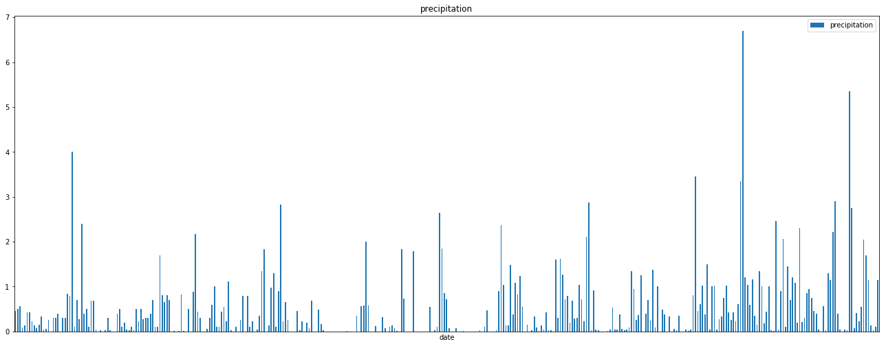
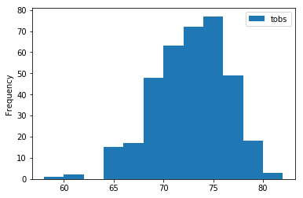
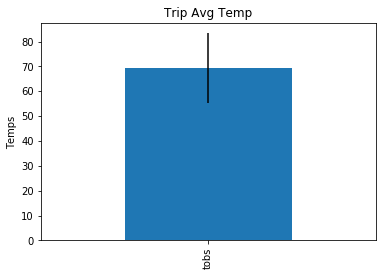

# Data Analysis and Exploration


```python
import sqlalchemy
from sqlalchemy.ext.automap import automap_base
from sqlalchemy.orm import Session
from sqlalchemy import create_engine, inspect 
from sqlalchemy import func, distinct

import pandas as pd
import numpy as np
import matplotlib.pyplot as plt
import seaborn as sns
import datetime as dt
```


```python
# Create the connection engine
engine = create_engine("sqlite:///hawaii.sqlite")
```


```python
# Declare a Base using `automap_base()`
Base = automap_base()
```


```python
# Use the Base class to reflect the database tables
Base.prepare(engine, reflect=True)
```


```python
# Show all of the classes mapped to the Base
Base.classes.keys()
```


    ['measurements', 'stations']


```python
# Assign the classess to a variable
Measurements = Base.classes.measurements
Stations = Base.classes.stations
```


```python
# Create a session
session = Session(engine)
```


```python
# Create the inspector and connect it to the engine
inspector = inspect(engine)

# Use Inspector to print the column names and types
columns = inspector.get_columns('measurements')
for c in columns:
    print(c['name'], c["type"])
```

    id INTEGER
    station TEXT
    date TEXT
    prcp FLOAT
    tobs FLOAT
    


```python
columns2 = inspector.get_columns('stations')
for c in columns2:
    print(c['name'], c["type"])
```

    station_id TEXT
    name TEXT
    latitude FLOAT
    longitude FLOAT
    elevation FLOAT
    

# Precipitation Analysis


```python
#query precipitation data
precip = session.query(Measurements.date, Measurements.prcp).\
    order_by(Measurements.id.desc()).limit(365).all()
```


```python
pdf = pd.DataFrame(precip, columns=['date', 'precipitation'])
pdf.set_index('date', inplace=True)
pdf.head()
```


<div>
<style scoped>
    .dataframe tbody tr th:only-of-type {
        vertical-align: middle;
    }

    .dataframe tbody tr th {
        vertical-align: top;
    }

    .dataframe thead th {
        text-align: right;
    }
</style>
<table border="1" class="dataframe">
  <thead>
    <tr style="text-align: right;">
      <th></th>
      <th>precipitation</th>
    </tr>
    <tr>
      <th>date</th>
      <th></th>
    </tr>
  </thead>
  <tbody>
    <tr>
      <th>8/23/2017</th>
      <td>0.45</td>
    </tr>
    <tr>
      <th>8/22/2017</th>
      <td>0.50</td>
    </tr>
    <tr>
      <th>8/21/2017</th>
      <td>0.56</td>
    </tr>
    <tr>
      <th>8/19/2017</th>
      <td>0.09</td>
    </tr>
    <tr>
      <th>8/17/2017</th>
      <td>0.13</td>
    </tr>
  </tbody>
</table>
</div>


```python
#plot precipitation data
pdf.plot.bar(subplots=True, figsize=(18,8))
plt.tight_layout()
plt.xticks([])
plt.show()
```





```python
pdf.describe()
```


<div>
<style scoped>
    .dataframe tbody tr th:only-of-type {
        vertical-align: middle;
    }

    .dataframe tbody tr th {
        vertical-align: top;
    }

    .dataframe thead th {
        text-align: right;
    }
</style>
<table border="1" class="dataframe">
  <thead>
    <tr style="text-align: right;">
      <th></th>
      <th>precipitation</th>
    </tr>
  </thead>
  <tbody>
    <tr>
      <th>count</th>
      <td>365.000000</td>
    </tr>
    <tr>
      <th>mean</th>
      <td>0.495562</td>
    </tr>
    <tr>
      <th>std</th>
      <td>0.775700</td>
    </tr>
    <tr>
      <th>min</th>
      <td>0.000000</td>
    </tr>
    <tr>
      <th>25%</th>
      <td>0.020000</td>
    </tr>
    <tr>
      <th>50%</th>
      <td>0.220000</td>
    </tr>
    <tr>
      <th>75%</th>
      <td>0.690000</td>
    </tr>
    <tr>
      <th>max</th>
      <td>6.700000</td>
    </tr>
  </tbody>
</table>
</div>


# Station Analysis


```python
#Count number of stations
session.query(Stations.station_id).count()
```


    9


```python
#count number of observations per station
sta_obs = pd.DataFrame(session.query(Measurements.station, func.count(Measurements.tobs)).\
        group_by(Measurements.station).\
        order_by(func.count(Measurements.tobs).desc()).all(),
             columns=['station', 'observations #'])
sta_obs
```


<div>
<style scoped>
    .dataframe tbody tr th:only-of-type {
        vertical-align: middle;
    }

    .dataframe tbody tr th {
        vertical-align: top;
    }

    .dataframe thead th {
        text-align: right;
    }
</style>
<table border="1" class="dataframe">
  <thead>
    <tr style="text-align: right;">
      <th></th>
      <th>station</th>
      <th>observations #</th>
    </tr>
  </thead>
  <tbody>
    <tr>
      <th>0</th>
      <td>USC00519281</td>
      <td>2772</td>
    </tr>
    <tr>
      <th>1</th>
      <td>USC00513117</td>
      <td>2696</td>
    </tr>
    <tr>
      <th>2</th>
      <td>USC00519397</td>
      <td>2685</td>
    </tr>
    <tr>
      <th>3</th>
      <td>USC00519523</td>
      <td>2572</td>
    </tr>
    <tr>
      <th>4</th>
      <td>USC00516128</td>
      <td>2484</td>
    </tr>
    <tr>
      <th>5</th>
      <td>USC00514830</td>
      <td>1937</td>
    </tr>
    <tr>
      <th>6</th>
      <td>USC00511918</td>
      <td>1932</td>
    </tr>
    <tr>
      <th>7</th>
      <td>USC00517948</td>
      <td>683</td>
    </tr>
    <tr>
      <th>8</th>
      <td>USC00518838</td>
      <td>342</td>
    </tr>
  </tbody>
</table>
</div>


```python
#The station with the highest number of observations
sta_obs.max()
```


    station           USC00519523
    observations #           2772
    dtype: object


# Temperature Analysis


```python
#query temperature 'tobs' data
sta = pd.DataFrame(session.query(Measurements.station, Measurements.date, Measurements.tobs).\
    order_by(Measurements.id.desc()).limit(365).all(),
             columns=['station', 'date', 'tobs'])
sta.head()
```


<div>
<style scoped>
    .dataframe tbody tr th:only-of-type {
        vertical-align: middle;
    }

    .dataframe tbody tr th {
        vertical-align: top;
    }

    .dataframe thead th {
        text-align: right;
    }
</style>
<table border="1" class="dataframe">
  <thead>
    <tr style="text-align: right;">
      <th></th>
      <th>station</th>
      <th>date</th>
      <th>tobs</th>
    </tr>
  </thead>
  <tbody>
    <tr>
      <th>0</th>
      <td>USC00516128</td>
      <td>8/23/2017</td>
      <td>76.0</td>
    </tr>
    <tr>
      <th>1</th>
      <td>USC00516128</td>
      <td>8/22/2017</td>
      <td>76.0</td>
    </tr>
    <tr>
      <th>2</th>
      <td>USC00516128</td>
      <td>8/21/2017</td>
      <td>76.0</td>
    </tr>
    <tr>
      <th>3</th>
      <td>USC00516128</td>
      <td>8/19/2017</td>
      <td>71.0</td>
    </tr>
    <tr>
      <th>4</th>
      <td>USC00516128</td>
      <td>8/17/2017</td>
      <td>72.0</td>
    </tr>
  </tbody>
</table>
</div>


```python
#create histogram
n_bins = 12
x = np.array(sta['tobs'])
plt.hist(x, n_bins, label='tobs')
plt.legend()
plt.ylabel('Frequency')
plt.show()
```





```python
#get temp for several days
day1 = pd.DataFrame((session.query(Measurements.tobs).\
    filter(Measurements.date.like('3/5/2017%')).all()))
day2 = pd.DataFrame((session.query(Measurements.tobs).\
    filter(Measurements.date.like('3/6/2017%')).all()))
day3 =pd.DataFrame((session.query(Measurements.tobs).\
    filter(Measurements.date.like('3/7/2017%')).all()))
daytemp = [day1,day2,day3]
temp = pd.concat(daytemp)
temp
```


<div>
<style scoped>
    .dataframe tbody tr th:only-of-type {
        vertical-align: middle;
    }

    .dataframe tbody tr th {
        vertical-align: top;
    }

    .dataframe thead th {
        text-align: right;
    }
</style>
<table border="1" class="dataframe">
  <thead>
    <tr style="text-align: right;">
      <th></th>
      <th>tobs</th>
    </tr>
  </thead>
  <tbody>
    <tr>
      <th>0</th>
      <td>71.0</td>
    </tr>
    <tr>
      <th>1</th>
      <td>70.0</td>
    </tr>
    <tr>
      <th>2</th>
      <td>73.0</td>
    </tr>
    <tr>
      <th>3</th>
      <td>68.0</td>
    </tr>
    <tr>
      <th>0</th>
      <td>69.0</td>
    </tr>
    <tr>
      <th>1</th>
      <td>66.0</td>
    </tr>
    <tr>
      <th>2</th>
      <td>67.0</td>
    </tr>
    <tr>
      <th>3</th>
      <td>76.0</td>
    </tr>
    <tr>
      <th>0</th>
      <td>68.0</td>
    </tr>
    <tr>
      <th>1</th>
      <td>65.0</td>
    </tr>
    <tr>
      <th>2</th>
      <td>74.0</td>
    </tr>
    <tr>
      <th>3</th>
      <td>62.0</td>
    </tr>
    <tr>
      <th>4</th>
      <td>72.0</td>
    </tr>
  </tbody>
</table>
</div>


```python
#create bar chart
means = temp.mean()
errors = temp.max()-temp.min()
fig, ax = plt.subplots()

ax.set_title('Trip Avg Temp')
plt.ylabel('Temps')
means.plot.bar(yerr=errors, ax=ax)
```


    <matplotlib.axes._subplots.AxesSubplot at 0x2b3ba9e4cf8>




